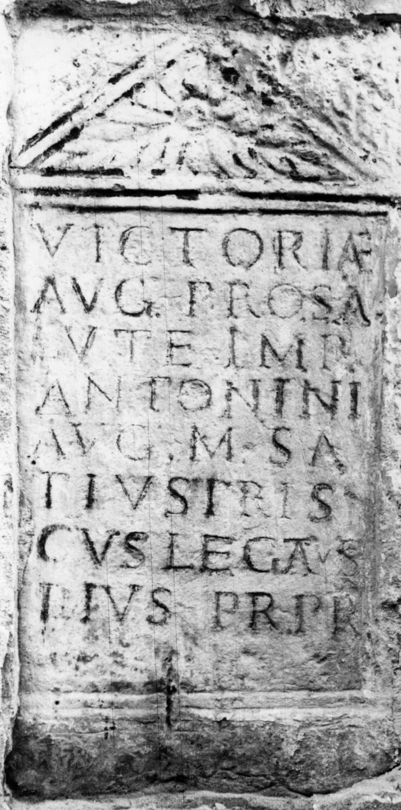
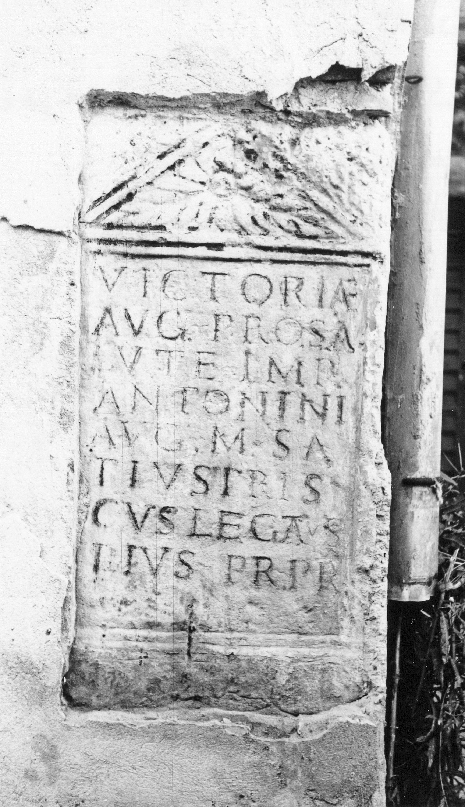

# EDH HD043923. Sarmizegetusa Regia, bei

**Країна.** Румунія

**Провінція (код EDH).** Dac

**Місце знахідки (антична назва).** Sarmizegetusa Regia, bei

**Сучасна назва.** Orăştioara de Sus

**Деталі знахідки.** {Grădiştea de Munte}, Sub Cununi

**Координати.** 45.634716200,23.216176899

**Зберігання.** Orăştie, Muz. Etnogr. şi Arta Pop.

**Датування (роки, від'ємні до н. е.).** 156 … 158

**Тип пам'ятки.** Altar

**Розміри (висота, ширина, глибина, см).** 100.0 × 51.0 × 16.0

## Текст (латинь, скорочення розкрито)

```
Victoriae / Aug(ustae) pro sa/lute Imp(eratoris) / Antonini / Aug(usti) M(arcus) Sta/tius Pris/cus legatus / eius pr(o) pr(aetore)
```

## Текст у вихідному записі

```
VICTORIAE / AVG PRO SA / LVTE IMP / ANTONINI / AVG M STA / TIVS PRIS / CVS LEGATVS / EIVS PR PR
```

## Література

AE 2001, 1716.
- C. Opreanu, EphNapocensis 10, 2000, 162-163; fig. 5 (Zeichnung). - AE 2001.
- IDR 3, 3, 276; fig. 208 (Foto u. Zeichnung).
- CIL 03, 01416.
- PIR (2. Aufl.) S 880. #

## Фото





Джерело https://edh.ub.uni-heidelberg.de/edh/inschrift/HD043923, ліцензія CC BY-SA 4.0. Оригінальний XML в архіві сирі_дані/edh_xml.zip
