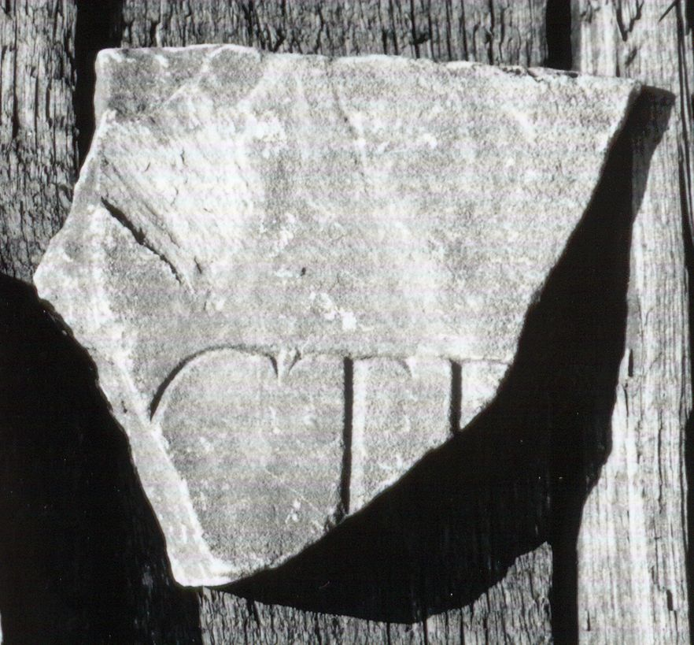

# EDH HD043987. Colonia Ulpia Traiana Sarmizegetusa

**Країна.** Румунія

**Провінція (код EDH).** Dac

**Місце знахідки (антична назва).** Colonia Ulpia Traiana Sarmizegetusa

**Сучасна назва.** Sarmizegetusa

**Деталі знахідки.** Praetorium procuratoris, {area sacra}

**Координати.** 45.515134153,22.787739334

**Датування (роки, від'ємні до н. е.).** 151 … 270

**Тип пам'ятки.** Tafel

**Розміри (висота, ширина, глибина, см).** -14.5 × 17.0 × 4.0

## Текст (латинь, скорочення розкрито)

```
[--- Vi?]ctr[ici? &
```

## Текст у вихідному записі

```
[ ]CTR[
```

## Література

AE 1998, 1105.
- I. Piso, ZPE 120, 1998, 269, Nr. 20; Foto u. Zeichnung. - AE 1998. #

## Фото



Джерело https://edh.ub.uni-heidelberg.de/edh/inschrift/HD043987, ліцензія CC BY-SA 4.0. Оригінальний XML в архіві сирі_дані/edh_xml.zip
