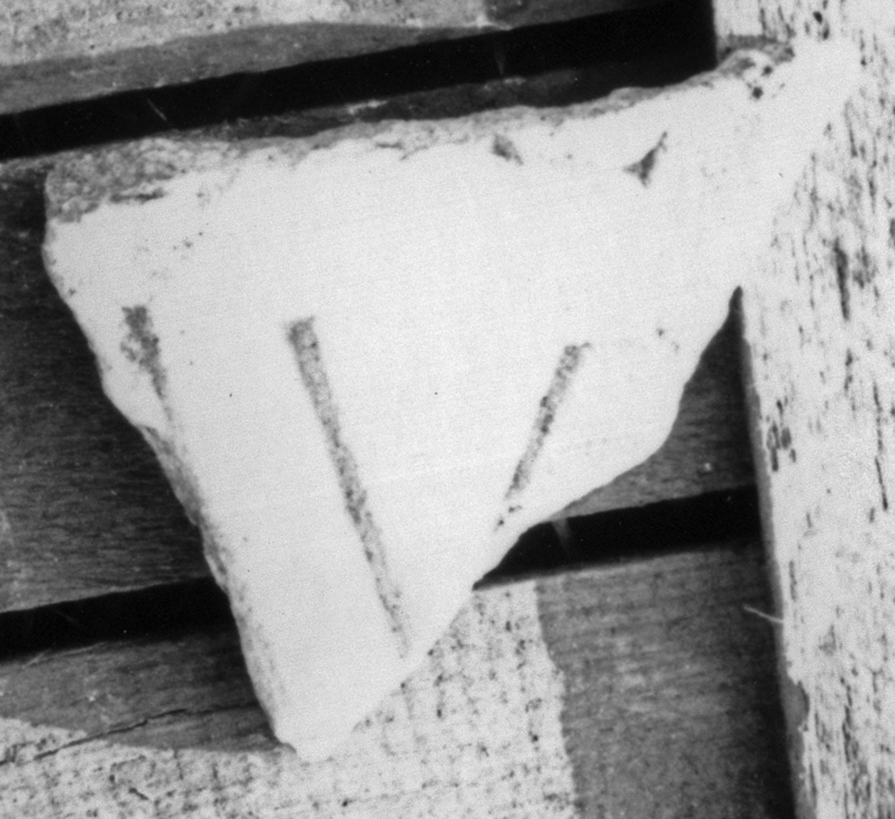

# EDH HD043988. Colonia Ulpia Traiana Sarmizegetusa

**Країна.** Румунія

**Провінція (код EDH).** Dac

**Місце знахідки (антична назва).** Colonia Ulpia Traiana Sarmizegetusa

**Сучасна назва.** Sarmizegetusa

**Деталі знахідки.** Praetorium procuratoris, {area sacra}

**Координати.** 45.515134153,22.787739334

**Датування (роки, від'ємні до н. е.).** 131 … 250

**Тип пам'ятки.** Tafel

**Розміри (висота, ширина, глибина, см).** -8.0 × -9.0 × 2.5

## Текст (латинь, скорочення розкрито)

```
$]L(?)A(?)[---] / [---]AVR(?)[&
```

## Текст у вихідному записі

```
]LA[ ] / [ ]AVR[
```

## Коментар

Z. 1: statt L auch E, statt A auch M möglich.

## Література

AE 1998, 1106.
- I. Piso, ZPE 120, 1998, 270, Nr. 21; Foto u. Zeichnung. - AE 1998. #

## Фото




Джерело https://edh.ub.uni-heidelberg.de/edh/inschrift/HD043988, ліцензія CC BY-SA 4.0. Оригінальний XML в архіві сирі_дані/edh_xml.zip
