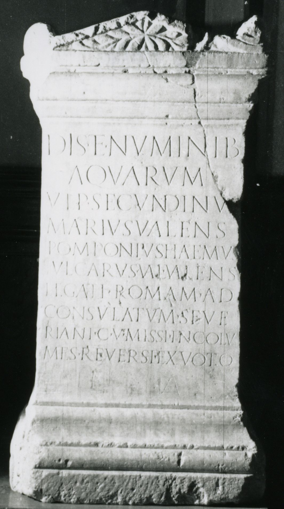

# EDH HD044086. Ad Mediam, bei

**Країна.** Румунія

**Провінція (код EDH).** Dac

**Місце знахідки (антична назва).** Ad Mediam, bei

**Сучасна назва.** Băile Herculane

**Деталі знахідки.** Badeanlagen, sekundär verwendet

**Координати.** 44.8786111,22.414166700

**Зберігання.** Băile Herculane, Muz. Ist.

**Датування (роки, від'ємні до н. е.).** 153 … 

**Тип пам'ятки.** Altar

**Розміри (висота, ширина, глибина, см).** 92.0 × 49.0 × 44.0

## Текст (латинь, скорочення розкрито)

```
Dis et Numinib(us) / Aquarum / Ulp(ius) Secundinus / Marius Valens / Pomponius Haemus / Iul(ius) Carus Val(erius) Valens / legati Romam ad / consulatum Seve/riani c(larissimi) v(iri) missi incolu/mes reversi ex voto / e(---) a(---)
```

## Текст у вихідному записі

```
DIS ET NVMINIB / AQVARVM / VLP SECVNDINVS / MARIVS VALENS / POMPONIVS HAEMVS / IVL CARVS VAL VALENS / LEGATI ROMAM AD / CONSVLATVM SEVE / RIANI C V MISSI INCOLV / MES REVERSI EX VOTO / E A
```

## Коментар

(B): Piso: Z. 6: Carus / Val(erius); CIL III: Z. 11 nicht wiedergegeben.

## Література

IDR 3, 1, 056; fig. 49 (Foto u. Zeichnung).
- CIL 03, 01562. (B)
- ILS 3896.
- I. Piso, Fasti provinciae Daciae 1. Die senatorischen Amtsträger (Bonn 1993) 61-66, Nr. 14, 9. (B)
- PIR (2. Aufl.) S 306. #

## Фото



Джерело https://edh.ub.uni-heidelberg.de/edh/inschrift/HD044086, ліцензія CC BY-SA 4.0. Оригінальний XML в архіві сирі_дані/edh_xml.zip
