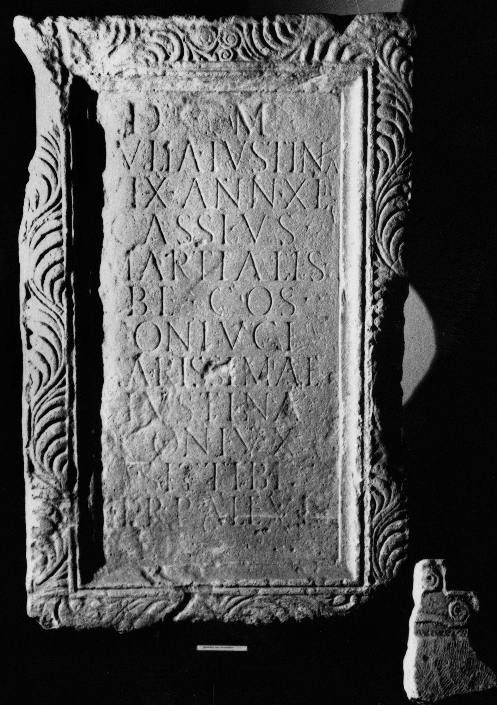

# EDH HD044150. Porolissum

**Країна.** Румунія

**Провінція (код EDH).** Dac

**Місце знахідки (антична назва).** Porolissum

**Сучасна назва.** Creaca

**Деталі знахідки.** Jac, {Pomet}, Hügel

**Координати.** 47.179766567,23.158138987

**Рік знахідки.** 1946

**Зберігання.** Zalău, Muz. Ist. Artă

**Датування (роки, від'ємні до н. е.).** 151 … 200

**Матеріал.** Kalkstein

**Тип пам'ятки.** Stele

**Розміри (висота, ширина, глибина, см).** -160.0 × 96.0 × 30.0

## Текст (латинь, скорочення розкрито)

```
D(is) M(anibus) / Iulia Iustina / vix(it) ann(os) XLII / Cassius / Martialis / be(neficiarius) co(n)s(ularis) / coniugi / carissimae / Iustina / coniux / sit tibi / terra levis
```

## Текст у вихідному записі

```
D M / IVLIA IVSTINA / VIX ANN XLII / CASSIVS / MARTIALIS / BE COS / CONIVGI / CARISSIMAE / IVSTINA / CONIVX / SIT TIBI / TERRA LEVIS
```

## Коментар

Z. 6: BE- statt BF-Ligatur mit waagrechter Mittelhaste. (B): ILD: Z. 6: b(ene)f(iciarius).

## Література

N. Gudea - V. Lucăcel, Inscripţii şi monumente sculpturale în Muzeul de Istorie şi Artă Zalău (Zalău 1975) 16, Nr. 16; Foto.
- ILD 701. (B)
- E. Schallmayer - K. Eibl - J. Ott - G. Preuß - E. Wittkopf, Der römische Weihebezirk von Osterburken 1 (Stuttgart 1990) 416, Nr. 541; Foto. #

## Фото



Джерело https://edh.ub.uni-heidelberg.de/edh/inschrift/HD044150, ліцензія CC BY-SA 4.0. Оригінальний XML в архіві сирі_дані/edh_xml.zip
