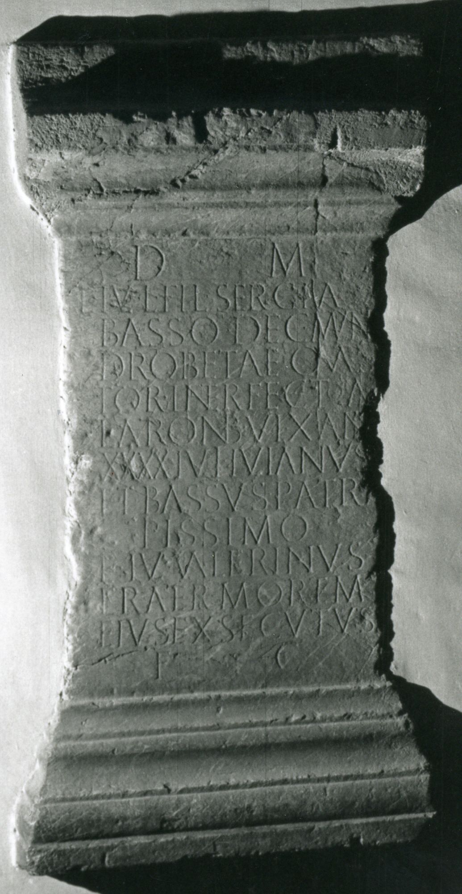

# EDH HD044348. Ad Mediam, bei

**Країна.** Румунія

**Провінція (код EDH).** Dac

**Місце знахідки (антична назва).** Ad Mediam, bei

**Сучасна назва.** Băile Herculane

**Координати.** 44.8786111,22.414166700

**Рік знахідки.** 1736

**Зберігання.** Wien, Nationalbibl.

**Датування (роки, від'ємні до н. е.).** 118 … 198

**Матеріал.** Marmor

**Тип пам'ятки.** Altar?

## Текст (латинь, скорочення розкрито)

```
D(is) M(anibus) / L(ucio) Iul(io) L(uci) fil(io) Sergia / Basso dec(urioni) mun(icipii) / Drobetae quaes/tori interfecto a / latronib(us) vix(it) an(nos) / XXXX Iuli(i) Iulianus / et Bassus patri / piissimo / et Iul(ius) Valerianus / frater mortem / eius exsecutus / f(aciendum) c(uraverunt)
```

## Текст у вихідному записі

```
D M / L IVL L FIL SERGIA / BASSO DEC MVN / DROBETAE QVAES / TORI INTERFECTO A / LATRONIB VIX AN / XXXX IVLI IVLIANVS / ET BASSVS PATRI / PIISSIMO / ET IVL VALERIANVS / FRATER MORTEM / EIVS EXSECVTVS / F C
```

## Коментар

Altar oder Statuenbasis. Hederae in Z. 1 u. 13; zahlreiche Ligaturen. (B): CIL III; Tudor; Petraccia: Leseabweichungen. Datierung: zwischen der Gründung des municipium Drobeta 118/9 oder 123/4 n. Chr. und vor seiner Erhebung zur colonia unter Septimius Severus 198 n. Chr.

## Література

AE 1960, 0339, 2.
- AE 2007, 1205.
- CIL 03, 01579. (B)
- IDR 3, 1, 071; fig. 57 (Foto u. Zeichnung).
- D. Tudor, StCercIstorV 4, 1953, 583-595, Nr. 2. - AE 1960.
- M.F. Petraccia, in: M. Mayer i Olivé - G. Baratta - A. Guzmán Almagro (Hrsg.), XII Congressus Internationalis Epigraphiae Graecae et Latinae. Provinciae Imperii Romani inscriptionibus descriptae, Barcelona 2002. Acta (Barcelona 2007) 1139-1146. (B) - AE 2007. #

## Фото



Джерело https://edh.ub.uni-heidelberg.de/edh/inschrift/HD044348, ліцензія CC BY-SA 4.0. Оригінальний XML в архіві сирі_дані/edh_xml.zip
