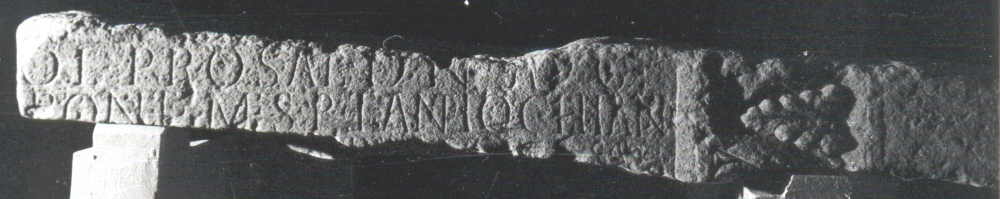

# EDH HD044427. Samum

**Країна.** Румунія

**Провінція (код EDH).** Dac

**Місце знахідки (антична назва).** Samum

**Сучасна назва.** Căşeiu

**Координати.** 47.196619299,23.857412299

**Датування (роки, від'ємні до н. е.).** 193 … 275

**Тип пам'ятки.** Tafel

**Розміри (висота, ширина, глибина, см).** -20.0 × -160.0 × 54.0

## Текст (латинь, скорочення розкрито)

```
[I(ovi) O(ptimo) M(aximo) D]ol(icheno) pro sal(ute) d(omini) n(ostri) Aug(usti) / [---] pont(ifex) m(unicipii) S(eptimii) P(orolissensium) et Antiochianus / [---]P(?)[---]SA(?)E(?) / [&?
```

## Текст у вихідному записі

```
[ ]OL PRO SAL D N AVG / [ ] PONT M S P ET ANTIOCHIANVS / [ ]P[ ]SAE / [
```

## Коментар

Inschriftfeld in Form einer tabula ansata. (B): CIL III; ILD: Abweichungen in der Lesung.

## Література

AE 1982, 0835.
- L. Balla, ACD 17/18, 1981/82, 195-197. - AE 1982 ILD 770. (B)
- CIL 03, 00828. (B) #

## Фото



Джерело https://edh.ub.uni-heidelberg.de/edh/inschrift/HD044427, ліцензія CC BY-SA 4.0. Оригінальний XML в архіві сирі_дані/edh_xml.zip
