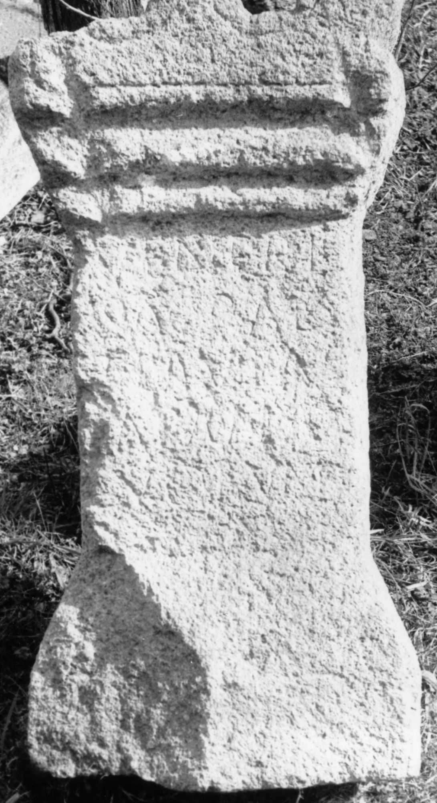

# EDH HD044451. Micia

**Країна.** Румунія

**Провінція (код EDH).** Dac

**Місце знахідки (антична назва).** Micia

**Сучасна назва.** Veţel

**Деталі знахідки.** {Thermen}

**Координати.** 45.914664689,22.815020084

**Зберігання.** Deva, Muz. Civil. Dac. şi Rom.

**Датування (роки, від'ємні до н. е.).** 151 … 270

**Тип пам'ятки.** Altar

**Розміри (висота, ширина, глибина, см).** 87.5 × 40.0 × 30.0

## Текст (латинь, скорочення розкрито)

```
Veneri / sacr(um) Ae(lia) / Flavia{e} / aram a(nimo?) / votum / p(osuit)
```

## Текст у вихідному записі

```
VENERI / SACR AE / FLAVIAE / ARAM A / VOTVM / P
```

## Коментар

Oberfläche stark verrieben; Lesung unsicher. (B): IDR III; ILD: Leseabweichungen.

## Література

ILD 309. (B)
- IDR 3, 3, 140; fig. 110 (Foto u. Zeichnung). (B) #

## Фото



Джерело https://edh.ub.uni-heidelberg.de/edh/inschrift/HD044451, ліцензія CC BY-SA 4.0. Оригінальний XML в архіві сирі_дані/edh_xml.zip
