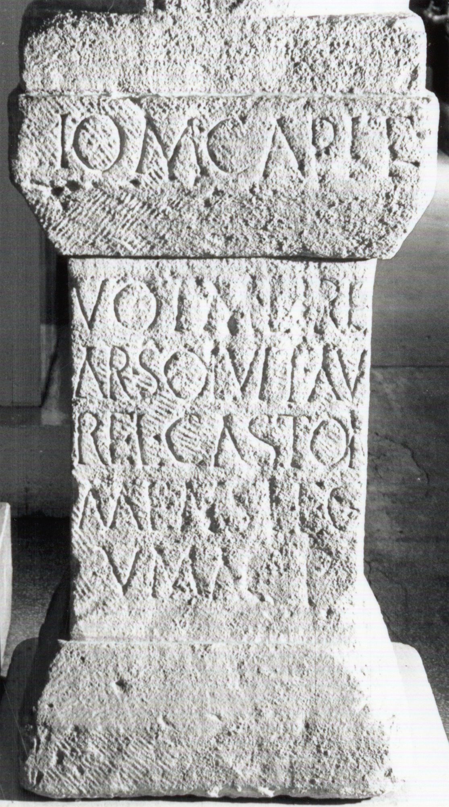

# EDH HD044474. Potaissa, bei

**Країна.** Румунія

**Провінція (код EDH).** Dac

**Місце знахідки (антична назва).** Potaissa, bei

**Сучасна назва.** Turda, bei

**Деталі знахідки.** {Strada Săndulești}, bei

**Координати.** 46.567987,23.766077799

**Зберігання.** Cluj-Napoca, Muz. Naţ. Ist. Transilv.

**Датування (роки, від'ємні до н. е.).** 167 … 275

**Тип пам'ятки.** Altar

**Розміри (висота, ширина, глибина, см).** 64.0 × 36.0 × 29.0

## Текст (латинь, скорочення розкрито)

```
I(ovi) O(ptimo) M(aximo) Capit(olino) / vot(u)m libe(ns) / a<n=R?>(imo?)#a<n>(imo?)#AR? solvit Au/rel(ius) Castor / mens(or) leg(ionis) / V Mac(edonicae) p(iae)
```

## Текст у вихідному записі

```
I O M CAPIT / VOTM LIBE / AR SOLVIT AV / REL CASTOR / MENS LEG / V MAC P
```

## Коментар

(B): ILD: Z. 5: mensor.

## Література

ILD 474. (B) #

## Фото



Джерело https://edh.ub.uni-heidelberg.de/edh/inschrift/HD044474, ліцензія CC BY-SA 4.0. Оригінальний XML в архіві сирі_дані/edh_xml.zip
