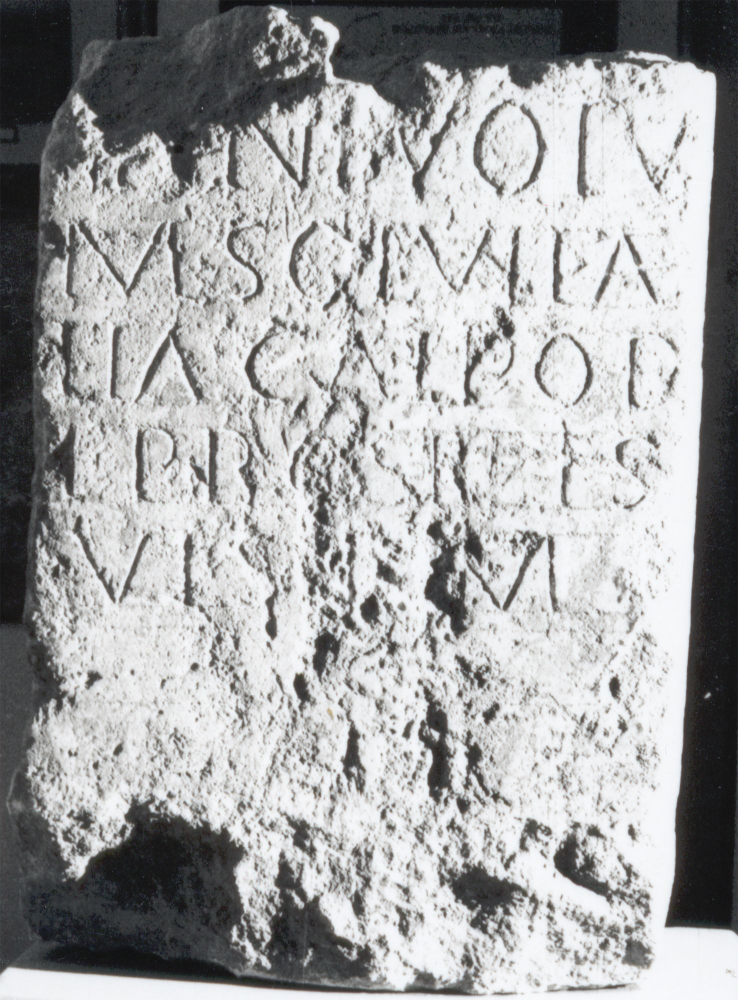

# EDH HD044512. Napoca

**Країна.** Румунія

**Провінція (код EDH).** Dac

**Місце знахідки (антична назва).** Napoca

**Сучасна назва.** Cluj-Napoca

**Координати.** 46.771741,23.576094000

**Датування (роки, від'ємні до н. е.).** 131 … 270

**Тип пам'ятки.** Altar

**Розміри (висота, ширина, глибина, см).** -50.0 × -42.0 × -25.0

## Текст (латинь, скорочення розкрито)

```
[Iunoni? Re?]/[gi?]n(a)e votu/m solvit Ae/lia Cal<li=P>op/e(?)#Cal<li>op/e(?)#CALPOPE pro se et s/uis l(ibens)(?) m(erito)
```

## Текст у вихідному записі

```
[ ] / [ ]NE VOTV / M SOLVIT AE / LIA CALPOP / E PRO SE ET S / VIS L M
```

## Коментар

(B): ILD: Leseabweichungen.

## Література

ILD 546. (B) #

## Фото



Джерело https://edh.ub.uni-heidelberg.de/edh/inschrift/HD044512, ліцензія CC BY-SA 4.0. Оригінальний XML в архіві сирі_дані/edh_xml.zip
