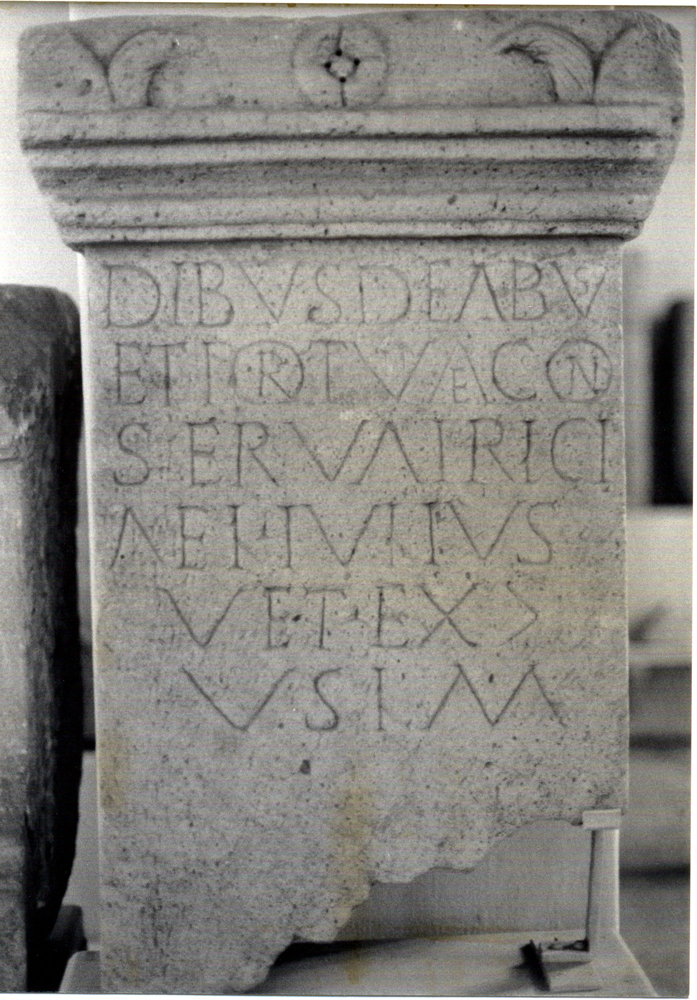

# EDH HD044543. Borşa

**Країна.** Румунія

**Провінція (код EDH).** Dac

**Сучасна назва.** Borşa

**Деталі знахідки.** {Ciumăfaia, Dombor, Berg, obere Terrasse}

**Координати.** 46.958665480,23.619754479

**Зберігання.** Cluj-Napoca, Muz. Naţ. Ist. Transilv.

**Датування (роки, від'ємні до н. е.).** 131 … 200

**Тип пам'ятки.** Tafel

**Розміри (висота, ширина, глибина, см).** 50.0 × 47.0

## Текст (латинь, скорочення розкрито)

```
Dibus deabus / et Fortunae Con/servatrici / Ael(ius) Iulius / vet(eranus) ex |(centurione) / v(otum) s(olvit) l(ibens) m(erito)
```

## Текст у вихідному записі

```
DIBVS DEABVS / ET FORTVNAE CON / SERVATRICI / AEL IVLIVS / VET EX | / V S L M
```

## Література

ILD 584. #

## Фото



Джерело https://edh.ub.uni-heidelberg.de/edh/inschrift/HD044543, ліцензія CC BY-SA 4.0. Оригінальний XML в архіві сирі_дані/edh_xml.zip
