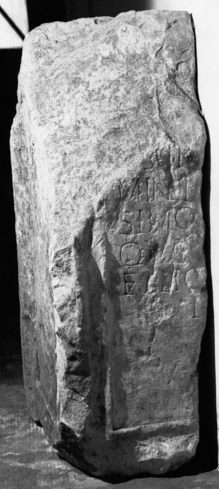

# EDH HD044554. Largiana

**Країна.** Румунія

**Провінція (код EDH).** Dac

**Місце знахідки (антична назва).** Largiana

**Сучасна назва.** Românaşi

**Координати.** 47.1133,23.181699999

**Зберігання.** Zalău, Muz. Ist. Artă

**Датування (роки, від'ємні до н. е.).** 107 … 275

**Тип пам'ятки.** Statuenbasis?

**Розміри (висота, ширина, глибина, см).** -107.0 × -66.0 × 37.0

## Текст (латинь, скорочення розкрито)

```
$] / [---]SCR[---]/mini [---]/simo [---] / QVAR[---]/elio[---] / M
```

## Текст у вихідному записі

```
] / [ ]SCR[ ] / MINI [ ] / SIMO [ ] / QVAR[ ] / ELIO[ ] / M
```

## Коментар

Fragment vom Mittelteil eines Altars oder einer Statuenbasis. Z. 6: statt M auch N möglich. (B): ILD: Z. 2: MIN[---].

## Література

ILD 650. (B)
- N. Gudea - V. Lucăcel, Inscripţii şi monumente sculpturale în Muzeul de Istorie şi Artă Zalău (Zalău 1975) 26, Nr. 51; Foto. #

## Фото



Джерело https://edh.ub.uni-heidelberg.de/edh/inschrift/HD044554, ліцензія CC BY-SA 4.0. Оригінальний XML в архіві сирі_дані/edh_xml.zip
