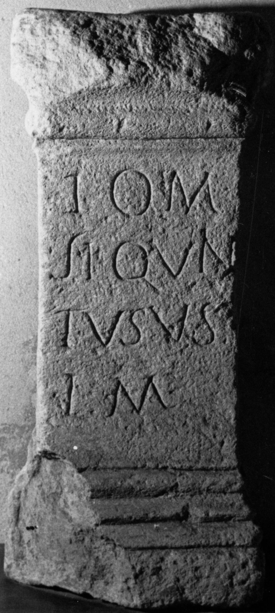

# EDH HD044557. Gârbova

**Країна.** Румунія

**Провінція (код EDH).** Dac

**Сучасна назва.** Gârbova

**Деталі знахідки.** {Reciu}

**Координати.** 45.866944,23.674999999

**Рік знахідки.** 1860

**Зберігання.** Sebeş, Muzeul

**Датування (роки, від'ємні до н. е.).** 106 … 250

**Тип пам'ятки.** Altar

**Розміри (висота, ширина, глибина, см).** 90.0 × 40.0 × 25.0

## Текст (латинь, скорочення розкрито)

```
I(ovi) O(ptimo) M(aximo) / S(extus?) L(icinius) Quin/tus v(otum) s(olvit) / l(ibens) m(erito)
```

## Текст у вихідному записі

```
I O M / S L QVIN / TVS V S / L M
```

## Коментар

Z. 2: S. S(extus) oder S(purius) möglich.

## Література

CIL 03, 00970.
- IDR 3, 4, 004; fig. 3 (Foto u. Zeichnung). #

## Фото



Джерело https://edh.ub.uni-heidelberg.de/edh/inschrift/HD044557, ліцензія CC BY-SA 4.0. Оригінальний XML в архіві сирі_дані/edh_xml.zip
