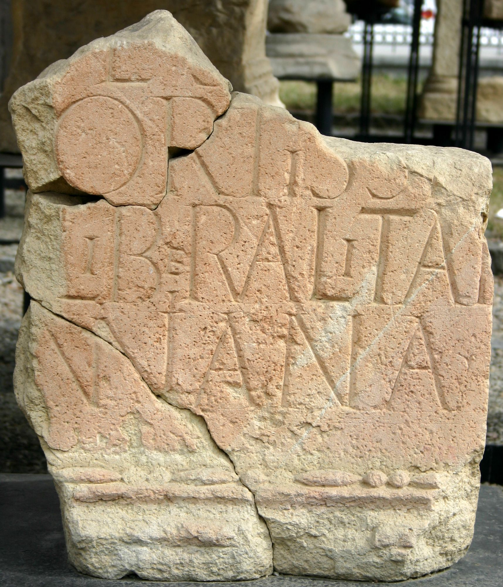
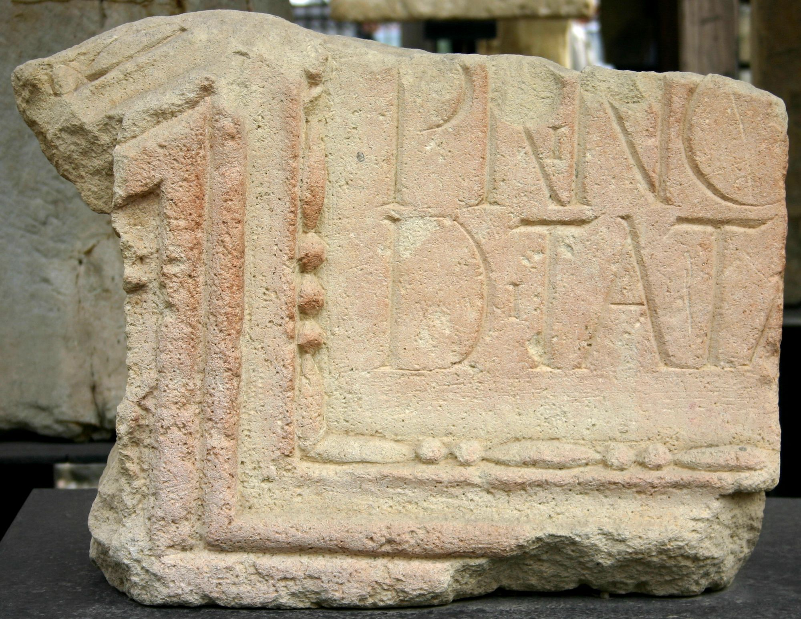
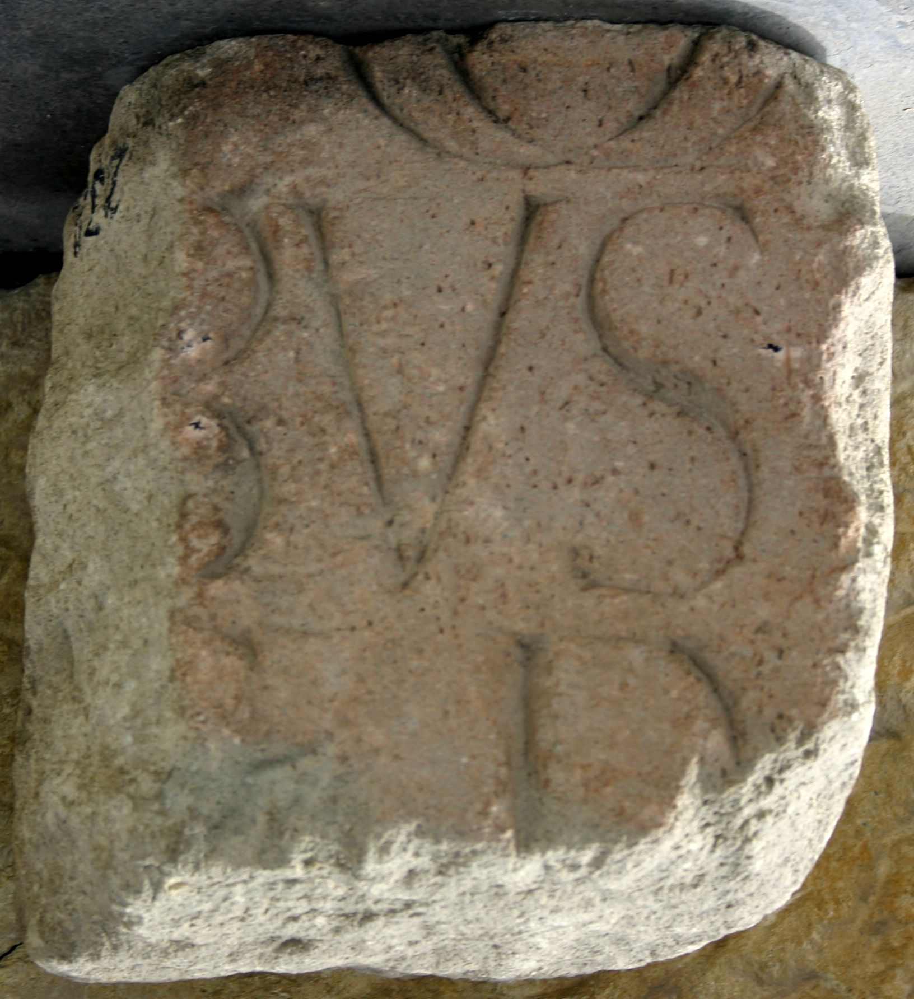

# EDH HD044565. Porolissum

**Країна.** Румунія

**Провінція (код EDH).** Dac

**Місце знахідки (антична назва).** Porolissum

**Сучасна назва.** Mirşid

**Деталі знахідки.** Moigrad, {Tempel des Iuppiter Dolichenus}

**Координати.** 47.181403688,23.157500624

**Рік знахідки.** 1939

**Зберігання.** Zalău, Muz. Ist. Artă (Fragmente a-f); verschollen (Fragment g)

**Датування (роки, від'ємні до н. е.).** 213 … 

**Матеріал.** Kalkstein

**Тип пам'ятки.** Tafel

## Текст (латинь, скорочення розкрито)

```
[Imperatori Caesari Marco Aurelio] / [Antonino Pio Felici Aug(usto) Parthico max(imo)] / [pont]if(ici) max(imo) B[rit(annico) max(imo) trib(unicia) pot]es[t(ate) XVI imp(eratori) II] / [co(n)s(uli) IIII] proco(n)[s(uli) felicissimo f]ortissimoq[ue] / princ(ipi) indul[gentiis eius aucta] liberalitat[i]busq[ue] / ditata [coh(ors) III Campestris Anto]niniana c(ivium) R(omanorum)
```

## Текст у вихідному записі

```
[ ] / [ ] / [ ]IF MAX B[ ]ES[ ] / [ ] PROCO[ ]ORTISSIMOQ[ ] / PRINC INDVL[ ] LIBERALITAT[ ]BVSQ[ ] / DITATA [ ]NINIANA C R
```

## Коментар

7 Fragmente erhalten; davon 2 erst 1943 gefunden. Rekonstruierte Maße: ca. 120 x 350 x 20 cm. Inschriftfeld in Form einer tabula ansata. Z. 2/3: Fragment g mit den Buchstaben [---]ART[---] / [---]O[---] ist heute verschollen. Lesung und Ergänzung nach Piso, ActaMusPorol. (B): Macrea; AE 1958; Tóth; AE 1979; Gudea - Lucăcel; ILD: Lesung / Ergänzung abweichend / unvollständig.

## Література

AE 2005, 1290.
- AE 1979, 0492. (B)
- AE 1958, 0231. (B)
- I. Piso, ActaMusNapoca 41/42, 2004/05, 185-188, Nr. II; fig. 2a; fig. 2b (Zeichnung). - AE 2005.
- I. Piso, in: F. Beutler - W. Hameter (Hrsg.), "Eine ganz normale Inschrift" ...
- und ähnliches zum Geburtstag von Ekkehard Weber. Festschrift zum 30. April 2005 (Wien 2005) 327-330; Abb. 1 (Foto u. Zeichnung). - AE 2005.
- E. Tóth, Porolissum. Das castellum in Moigrad. Ausgrabungen von A. Radnóti, 1943 (Budapest 1978) 22-24, Nr. 10; Taf. 6, 10. (B) - AE 1979.
- M. Macrea, StCercIstorV 8, 1957, 227-234, Nr. 3; fig. 4; fig. 5 (Zeichnung). (B) - AE 1958.
- N. Gudea - V. Lucăcel, Inscripţii şi monumente sculpturale în Muzeul de Istorie şi Artă Zalău (Zalău 1975) 9-10, Nr. 4; Fotos. (B)
- ILD 661. (B)
- AE 2015, 1142.
- I. Piso, ActaMusPorol 37, 2015, 204-206, Nr. 23; fig. 24 u. 25 (Zeichnungen). - AE 2015. #

## Фото







Джерело https://edh.ub.uni-heidelberg.de/edh/inschrift/HD044565, ліцензія CC BY-SA 4.0. Оригінальний XML в архіві сирі_дані/edh_xml.zip
