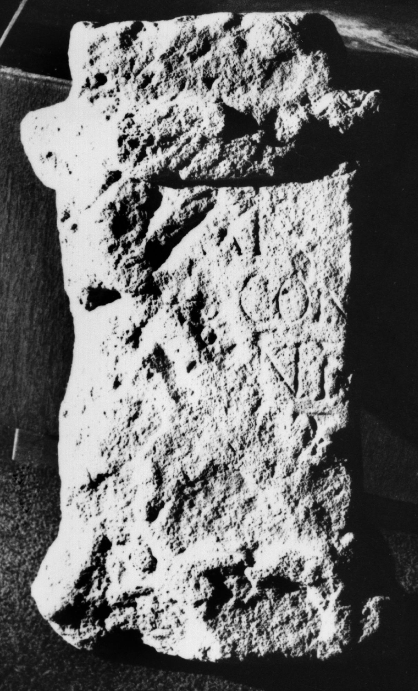

# EDH HD044636. Porolissum

**Країна.** Румунія

**Провінція (код EDH).** Dac

**Місце знахідки (антична назва).** Porolissum

**Сучасна назва.** Creaca

**Деталі знахідки.** Jac, {Pomet}, Hügel

**Координати.** 47.179766567,23.158138987

**Зберігання.** Zalău, Muz. Ist. Artă

**Датування (роки, від'ємні до н. е.).** 151 … 270

**Матеріал.** Kalkstein

**Тип пам'ятки.** Altar

**Розміри (висота, ширина, глибина, см).** 40.0 × 25.0 × 11.0

## Текст (латинь, скорочення розкрито)

```
[---]A(?)N(?) / [---] con/[---]nti / [---]T / [------](?)
```

## Текст у вихідному записі

```
[ ]AN / [ ] CON / [ ]NTI / [ ]T / [ ]
```

## Література

ILD 723.
- N. Gudea - V. Lucăcel, Inscripţii şi monumente sculpturale în Muzeul de Istorie şi Artă Zalău (Zalău 1975) 21, Nr. 32; Foto. #

## Фото



Джерело https://edh.ub.uni-heidelberg.de/edh/inschrift/HD044636, ліцензія CC BY-SA 4.0. Оригінальний XML в архіві сирі_дані/edh_xml.zip
