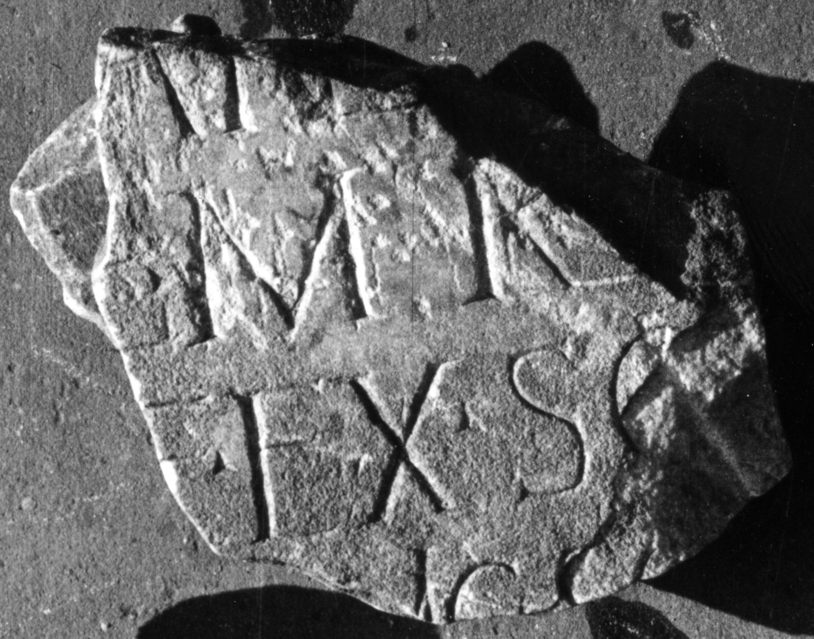

# EDH HD044780. Micia

**Країна.** Румунія

**Провінція (код EDH).** Dac

**Місце знахідки (антична назва).** Micia

**Сучасна назва.** Veţel

**Деталі знахідки.** {Micia}

**Координати.** 45.914556455,22.816629409

**Зберігання.** Deva, Muz. Civil. Dac. şi Rom.

**Датування (роки, від'ємні до н. е.).** 171 … 270

**Розміри (висота, ширина, глибина, см).** -20.0 × -18.0 × -45.0

## Текст (латинь, скорочення розкрито)

```
$]AND[---] / [---]E(?) M TR(?) / [---]E ex SO[---] / [---]MIC S S(?)[&
```

## Текст у вихідному записі

```
]AND[ ] / [ ]E M TR / [ ]E EX SO[ ] / [ ]MIC S S[
```

## Коментар

IDR III 3; Schallmayer u. a.: abweichende Lesung. (B): IDR III: Leseabweichungen.

## Література

ILD 305.
- IDR 3, 3, 061; fig. 48 (Foto u. Zeichnung). (B)
- E. Schallmayer - K. Eibl - J. Ott - G. Preuß - E. Wittkopf, Der römische Weihebezirk von Osterburken 1 (Stuttgart 1990) 431, Nr. 564. (B) #

## Фото



Джерело https://edh.ub.uni-heidelberg.de/edh/inschrift/HD044780, ліцензія CC BY-SA 4.0. Оригінальний XML в архіві сирі_дані/edh_xml.zip
