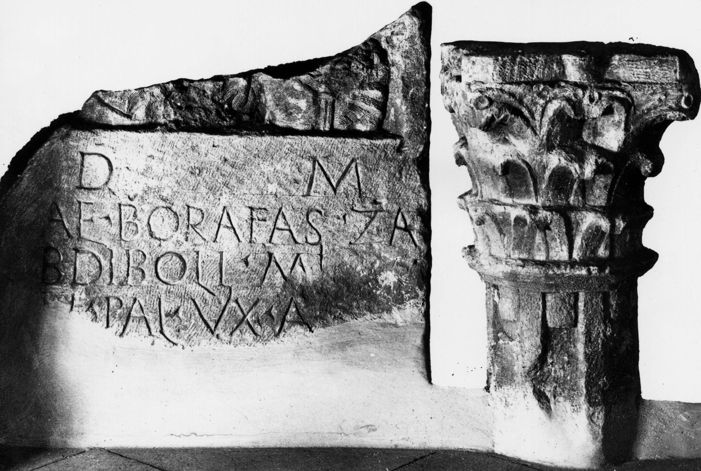

# EDH HD044785. Tibiscum

**Країна.** Румунія

**Провінція (код EDH).** Dac

**Місце знахідки (антична назва).** Tibiscum

**Сучасна назва.** Caransebeş

**Деталі знахідки.** Jupa, {Herrenhaus}

**Координати.** 45.458724427,22.186123319

**Зберігання.** Budapest, Magyar Nemzeti Múz.

**Датування (роки, від'ємні до н. е.).** 151 … 270

**Тип пам'ятки.** Stele

**Розміри (висота, ширина, глибина, см).** -58.0 × 68.0 × 12.0

## Текст (латинь, скорочення розкрито)

```
D(is) M(anibus) / Ael(ius) Borafas Za/bdiboli mil(es) [e]x / n(umero) Pal(myrenorum) vix(it) a[n(nos) ---] / et Valeria C(?)[---] / et Zab[di]bo[lus? ---] / FN[---]RVM / FN[---]VFR / [&?
```

## Текст у вихідному записі

```
D M / AEL BORAFAS ZA / BDIBOLI MIL [ ]X / N PAL VIX A[ ] / ET VALERIA C[ ] / ET ZAB[ ]BO[ ] / FN[ ]RVM / FN[ ]VFR / [
```

## Коментар

Oberhalb des Inschriftfeldes Reste einer männlichen und einer weiblichen Büste. 3 Fragmente; Maße beziehen sich auf Fragment a (= CIL III und IDR III); Maße Fragment b: (33) x (34) x 13 cm; Fragment c: (18) x (14) x 13 cm. Zeilenlinien für die Beschriftung. (B): CIL III; IDR III; ILD: Leseabweichungen.

## Література

ILD 216. (B)
- IDR 3, 1, 152; fig. 120 (Foto u. Zeichnung). (B)
- CIL 03, 14216. (B) #

## Фото



Джерело https://edh.ub.uni-heidelberg.de/edh/inschrift/HD044785, ліцензія CC BY-SA 4.0. Оригінальний XML в архіві сирі_дані/edh_xml.zip
