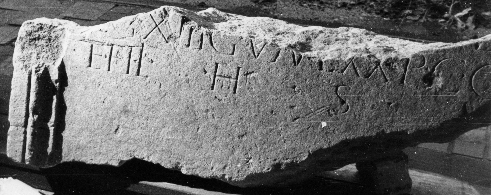
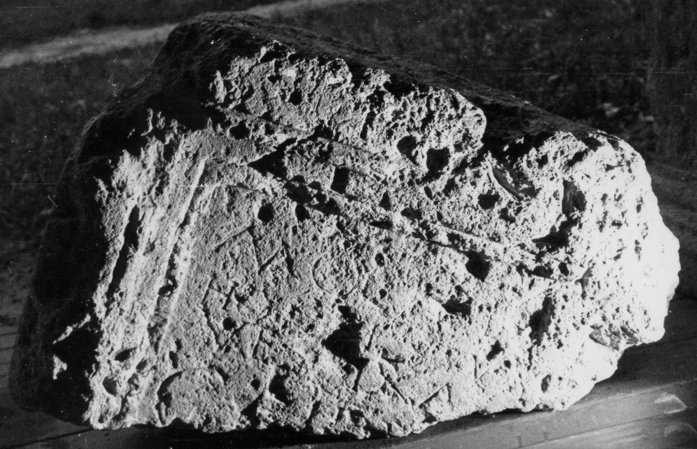

# EDH HD044790. Miercurea Sibiului

**Країна.** Румунія

**Провінція (код EDH).** Dac

**Сучасна назва.** Miercurea Sibiului

**Деталі знахідки.** {Apoldu de Sus}

**Координати.** 45.850624608,23.828229904

**Рік знахідки.** 1862

**Зберігання.** Sibiu, Muz. Brukenthal

**Датування (роки, від'ємні до н. е.).** 101 … 250

**Тип пам'ятки.** Altar

**Розміри (висота, ширина, глибина, см).** -90.0 × -66.0 × -26.0

## Текст (латинь, скорочення розкрито)

```
D(is) M(anibus) // MOCIO Bov[---] / hoc [m]issus(?) / ve[t(eranus) v]ix(it) an(nos) / Calp[---](?) / [& // $] / [---] MOCV/LI A(d)iutor(?) vixit an(nos) XXIV / Terentius [fi]lis posuit
```

## Текст у вихідному записі

```
D M / / MOCIO BOV[ ] / HOC [ ]ISSVS / VE[ ]IX AN / CALP[ ] / [ / / ] / [ ] MOCV / LI AIVTOR VIXIT AN XXIV / TERENTIVS [ ]LIS POSVIT
```

## Коментар

Zwei nicht aneinander passende Fragmente erhalten; Maße des größeren, oberen Fragments: s.o.; Maße des unteren, kleineren Fragments: (86) x (60) x (23). Textwiedergabe nach IDR.

## Література

IDR 3, 4, 012; fig. 7a u. b (Fotos u. Zeichnungen).
- CIL 03, 00969 add. p. 1015.
- CIL 03, 00969. #

## Фото





Джерело https://edh.ub.uni-heidelberg.de/edh/inschrift/HD044790, ліцензія CC BY-SA 4.0. Оригінальний XML в архіві сирі_дані/edh_xml.zip
