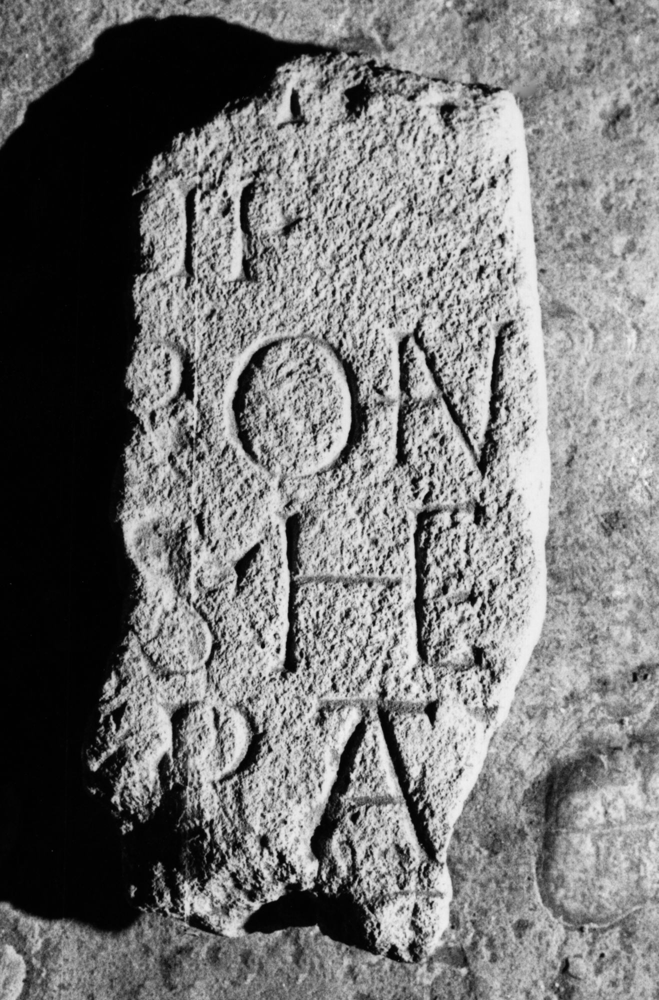

# EDH HD044798. Sebeş

**Країна.** Румунія

**Провінція (код EDH).** Dac

**Сучасна назва.** Sebeş

**Координати.** 45.958949999,23.570868900

**Зберігання.** Sebeş, Muzeul

**Датування (роки, від'ємні до н. е.).** 101 … 250

**Тип пам'ятки.** Tafel

**Розміри (висота, ширина, глибина, см).** -37.0 × -17.0 × 8.0

## Текст (латинь, скорочення розкрито)

```
$] / [---]I / [---]CII / [--- pat]ron(---)(?) / [---]S he/[re---?]I patri / [---]O[---] / [&?
```

## Текст у вихідному записі

```
] / [ ]I / [ ]CII / [ ]RON / [ ]S HE / [ ]I PATRI / [ ]O[ ] / [
```

## Література

IDR 3, 4, 023; fig. 13 (Foto u. Zeichnung). #

## Фото



Джерело https://edh.ub.uni-heidelberg.de/edh/inschrift/HD044798, ліцензія CC BY-SA 4.0. Оригінальний XML в архіві сирі_дані/edh_xml.zip
