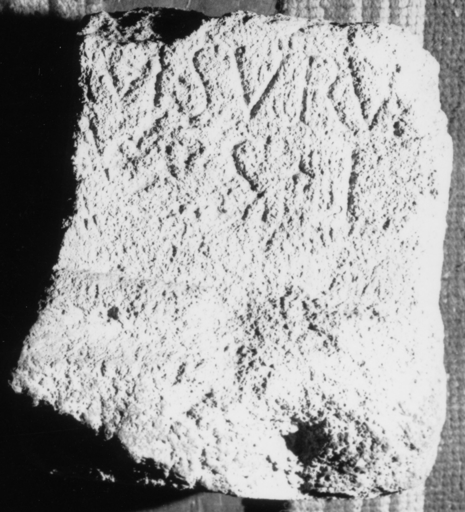

# EDH HD044927. Miraslău

**Країна.** Румунія

**Провінція (код EDH).** Dac

**Сучасна назва.** Miraslău

**Деталі знахідки.** {Decea}

**Координати.** 46.383399999,23.764400000

**Зберігання.** Aiud, Muz. Ist.

**Датування (роки, від'ємні до н. е.).** 101 … 250

**Тип пам'ятки.** Altar

**Розміри (висота, ширина, глибина, см).** -34.0 × -28.0 × -20.0

## Текст (латинь, скорочення розкрито)

```
Invicto / M(ithrae) Surus / v(otum) s(olvit) l(ibens)
```

## Текст у вихідному записі

```
INVICTO / M SVRVS / V S L
```

## Література

CIL 03, 12548.
- IDR 3, 4, 071; fig. 33 (Foto u. Zeichnung).
- CIMRM 1932. #

## Фото



Джерело https://edh.ub.uni-heidelberg.de/edh/inschrift/HD044927, ліцензія CC BY-SA 4.0. Оригінальний XML в архіві сирі_дані/edh_xml.zip
