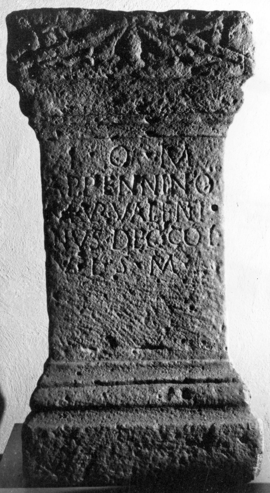

# EDH HD044930. Aquae, bei

**Країна.** Румунія

**Провінція (код EDH).** Dac

**Місце знахідки (антична назва).** Aquae, bei

**Сучасна назва.** Călan

**Деталі знахідки.** {Valea Sângeorgiului}, nördlich

**Координати.** 45.7455298,23.062383899

**Зберігання.** Deva, Muz. Civil. Dac. şi Rom.

**Датування (роки, від'ємні до н. е.).** 171 … 270

**Тип пам'ятки.** Altar

**Розміри (висота, ширина, глибина, см).** 112.0 × 59.0 × 35.0

## Текст (латинь, скорочення розкрито)

```
I(ovi) O(ptimo) M(aximo) / Appennino / M(arcus) Aur(elius) Valenti/nus dec(urio) col(oniae) / v(otum) l(ibens) s(olvit) m(erito)
```

## Текст у вихідному записі

```
I O M / APPENNINO / M AVR VALENTI / NVS DEC COL / V L S M
```

## Література

IDR 3, 3, 017; fig. 15 (Foto u. Zeichnung).
- CIL 03, 12576. #

## Фото



Джерело https://edh.ub.uni-heidelberg.de/edh/inschrift/HD044930, ліцензія CC BY-SA 4.0. Оригінальний XML в архіві сирі_дані/edh_xml.zip
