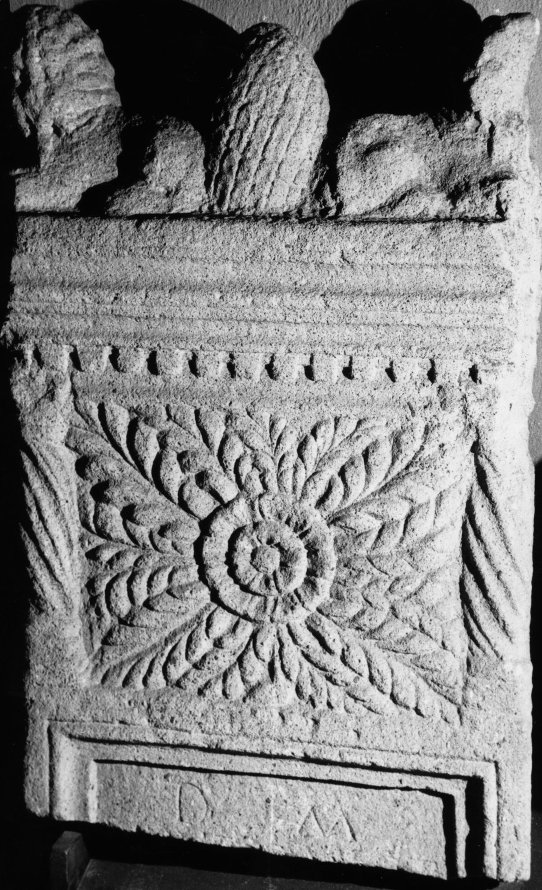

# EDH HD044946. Sibiu, bei?

**Країна.** Румунія

**Провінція (код EDH).** Dac

**Сучасна назва.** Sibiu, bei?

**Координати.** 45.792784,24.152068999

**Зберігання.** Sibiu, Muz. Brukenthal

**Датування (роки, від'ємні до н. е.).** 101 … 250

**Тип пам'ятки.** Stele

**Розміри (висота, ширина, глибина, см).** -120.0 × 75.0 × 22.0

## Текст (латинь, скорочення розкрито)

```
D(is) M(anibus) / [&
```

## Текст у вихідному записі

```
D M / [
```

## Коментар

Genauer Fundort unbekannt.

## Література

IDR 3, 4, 095; fig. 51 (Foto u. Zeichnung). #

## Фото



Джерело https://edh.ub.uni-heidelberg.de/edh/inschrift/HD044946, ліцензія CC BY-SA 4.0. Оригінальний XML в архіві сирі_дані/edh_xml.zip
