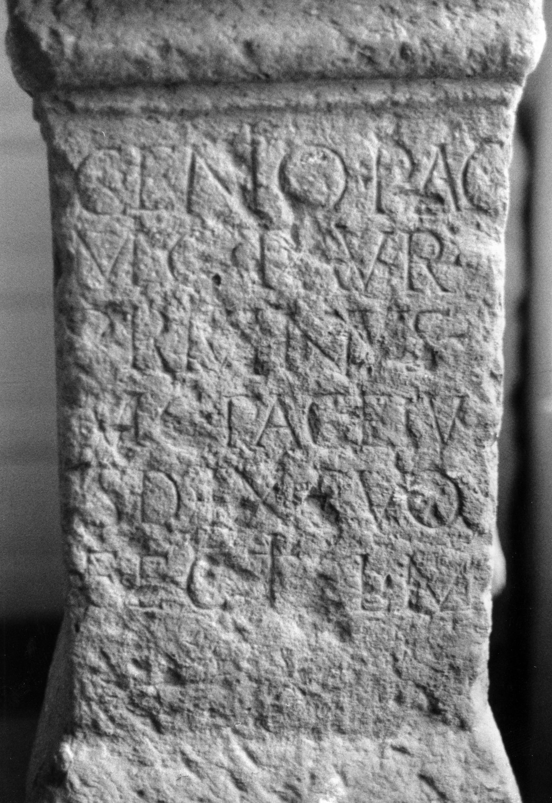

# EDH HD045045. Micia, aus

**Країна.** Румунія

**Провінція (код EDH).** Dac

**Місце знахідки (антична назва).** Micia, aus

**Сучасна назва.** Hunedoara

**Деталі знахідки.** {Schloss Hunedoara}

**Координати.** 45.749167,22.888333

**Рік знахідки.** 1863

**Зберігання.** Cluj-Napoca, Muz. Naţ. Ist. Transilv.

**Датування (роки, від'ємні до н. е.).** 171 … 270

**Тип пам'ятки.** Altar

**Розміри (висота, ширина, глибина, см).** 94.0 × 45.0 × 37.0

## Текст (латинь, скорочення розкрито)

```
Genio pag(i) / Mic(iae) T(itus) Aur(elius) / Primanus / mag(ister) pag(i) eiu/sd(em) ex suo / fecit l(ibens) m(erito)
```

## Текст у вихідному записі

```
GENIO PAG / MIC T AVR / PRIMANVS / MAG PAG EIV / SD EX SVO / FECIT L M
```

## Література

AE 2004, 1208.
- D. Alicu, in: Studia historica et archaeologica in honorem magistrae Doina Benea (Timişoara 2004) 14, Nr. 4; fig. 4. - AE 2004.
- IDR 3, 3, 069; fig. 56 (Foto u. Zeichnung).
- ILS 7151.
- CIL 03, 01405.
- CIL 03, 07847. #

## Фото



Джерело https://edh.ub.uni-heidelberg.de/edh/inschrift/HD045045, ліцензія CC BY-SA 4.0. Оригінальний XML в архіві сирі_дані/edh_xml.zip
