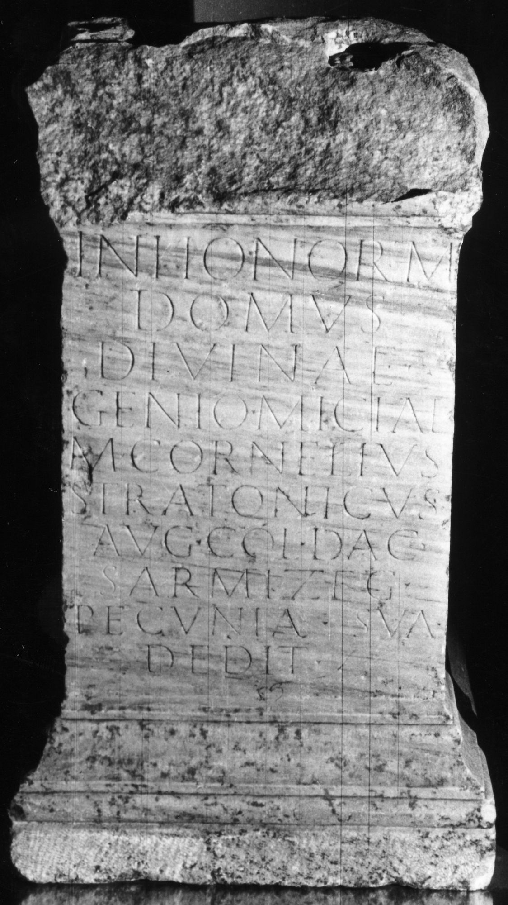

# EDH HD045046. Micia

**Країна.** Румунія

**Провінція (код EDH).** Dac

**Місце знахідки (антична назва).** Micia

**Сучасна назва.** Veţel

**Деталі знахідки.** {Lager}, östlich

**Координати.** 45.912028,22.815583

**Рік знахідки.** 1967

**Зберігання.** Deva, Muz. Civil. Dac. şi Rom.

**Датування (роки, від'ємні до н. е.).** 107 … 170

**Тип пам'ятки.** Altar

**Розміри (висота, ширина, глибина, см).** 103.0 × 60.0 × 38.0

## Текст (латинь, скорочення розкрито)

```
In honorem / domus / divinae / Genio Miciae / M(arcus) Cornelius / Stratonicus / Aug(ustalis) col(oniae) Dac(icae) / Sarmizeg(etusae) / pecunia sua / dedit
```

## Текст у вихідному записі

```
IN HONOREM / DOMVS / DIVINAE / GENIO MICIAE / M CORNELIVS / STRATONICVS / AVG COL DAC / SARMIZEG / PECVNIA SVA / DEDIT
```

## Література

IDR 3, 3, 070; fig. 57 (Foto u. Zeichnung). #

## Фото



Джерело https://edh.ub.uni-heidelberg.de/edh/inschrift/HD045046, ліцензія CC BY-SA 4.0. Оригінальний XML в архіві сирі_дані/edh_xml.zip
