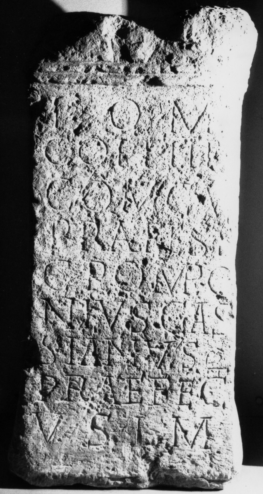

# EDH HD045075. Micia, aus?

**Країна.** Румунія

**Провінція (код EDH).** Dac

**Місце знахідки (антична назва).** Micia, aus?

**Сучасна назва.** Deva

**Деталі знахідки.** {Strada Gheorghe Bariţiu 2 (ehemaliges Präparandiegebäude, ehemaliger Fiscalhof)}

**Координати.** 45.880545804,22.896993756

**Рік знахідки.** 1876

**Зберігання.** Deva, Muz. Civil. Dac. şi Rom.

**Датування (роки, від'ємні до н. е.).** 151 … 270

**Матеріал.** Tuff

**Тип пам'ятки.** Altar

**Розміри (висота, ширина, глибина, см).** -96.0 × -45.0 × -38.0

## Текст (латинь, скорочення розкрито)

```
I(ovi) O(ptimo) M(aximo) / coh(ors) II F[l(avia)] / Com(magenorum) cu[i] / praeest / C(aius) Pompo/nius Cas/sianus / praefect(us) / v(otum) s(olvit) l(ibens) m(erito)
```

## Текст у вихідному записі

```
I O M / COH II F[ ] / COM CV[ ] / PRAEEST / C POMPO / NIVS CAS / SIANVS / PRAEFECT / V S L M
```

## Коментар

Hederae.

## Література

AE 2004, 1183.
- A. Ştefănescu, Apulum 41, 2004, 272-276; fig. 5 (Foto u. Zeichnung). - AE 2004.
- CIL 03, 07848.
- IDR 3, 3, 078; fig. 63 (Foto u. Zeichnung). #

## Фото



Джерело https://edh.ub.uni-heidelberg.de/edh/inschrift/HD045075, ліцензія CC BY-SA 4.0. Оригінальний XML в архіві сирі_дані/edh_xml.zip
