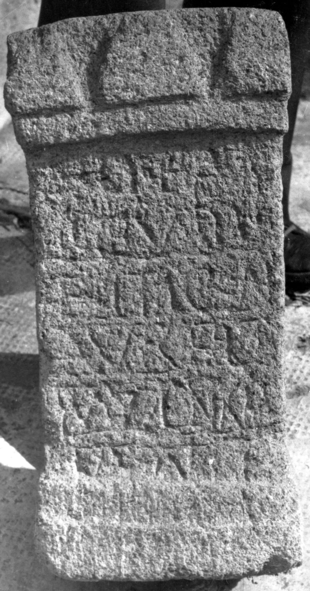
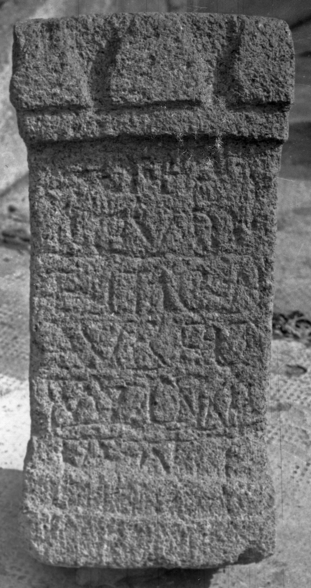

# EDH HD045077. Micia?

**Країна.** Румунія

**Провінція (код EDH).** Dac

**Місце знахідки (антична назва).** Micia?

**Сучасна назва.** Vețel?

**Координати.** 45.913675652,22.815642356

**Рік знахідки.** -1900

**Зберігання.** Deva, Muz. Civil. Dac. şi Rom.

**Датування (роки, від'ємні до н. е.).** 171 … 270

**Тип пам'ятки.** Altar

**Розміри (висота, ширина, глибина, см).** 54.0 × 28.0 × 20.0

## Текст (латинь, скорочення розкрито)

```
I(ovi) O(ptimo) M(aximo) / [v(eterani)] civ(es) R(omani) M/[ic(ienses)?] per M(arcum) / Aur(elium) Tert/ium qu(a)est(orem)(?) / v(otum) l(ibentes)(?) m(erito) s(olverunt)
```

## Текст у вихідному записі

```
I O M / [ ] CIV R M / [ ] PER M / AVR TERT / IVM QVEST / V L M S
```

## Коментар

Zeilenlinien für die Beschriftung. (B): CIL III: abweichende Lesung.

## Література

IDR 3, 3, 084; fig. 68 (Foto u. Zeichnung).
- CIL 03, 01367. (B) #

## Фото





Джерело https://edh.ub.uni-heidelberg.de/edh/inschrift/HD045077, ліцензія CC BY-SA 4.0. Оригінальний XML в архіві сирі_дані/edh_xml.zip
