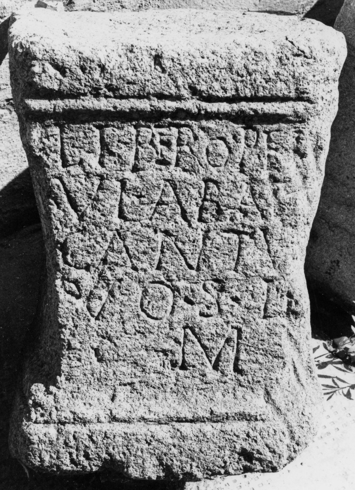
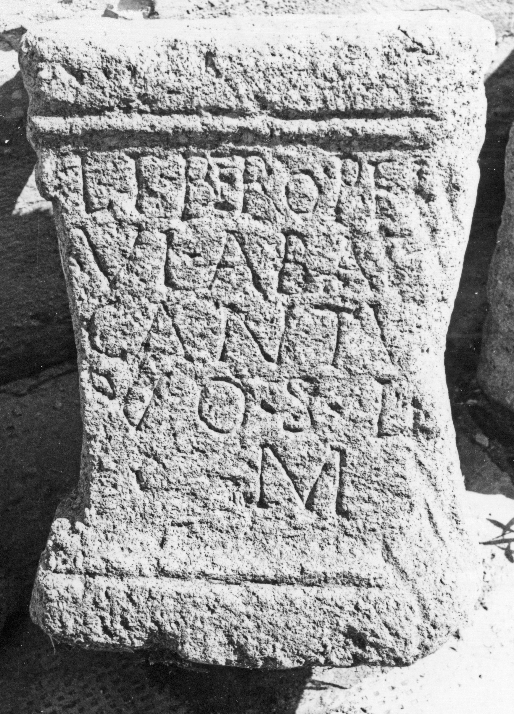

# EDH HD045094. Micia

**Країна.** Румунія

**Провінція (код EDH).** Dac

**Місце знахідки (антична назва).** Micia

**Сучасна назва.** Veţel

**Координати.** 45.914556455,22.816543578

**Зберігання.** Deva, Muz. Civil. Dac. şi Rom.

**Датування (роки, від'ємні до н. е.).** 151 … 270

**Матеріал.** Tuff

**Тип пам'ятки.** Altar?

**Розміри (висота, ширина, глибина, см).** 45.0 × 34.0 × 26.0

## Текст (латинь, скорочення розкрито)

```
Libero P(atri) e(t) L(iberae?) / Ul(pius)(?) Abas/cantu[s] / vo(tum) s(olvit) l(ibens) / m(erito)
```

## Текст у вихідному записі

```
LIBERO P E L / VL ABAS / CANTV[ ] / VO S L / M
```

## Коментар

Altar oder Statuenbasis. Z. 2: möglicherweise auch [I]ul(ius).

## Література

IDR 3, 3, 103; fig. 79 (Foto u. Zeichnung). #

## Фото





Джерело https://edh.ub.uni-heidelberg.de/edh/inschrift/HD045094, ліцензія CC BY-SA 4.0. Оригінальний XML в архіві сирі_дані/edh_xml.zip
