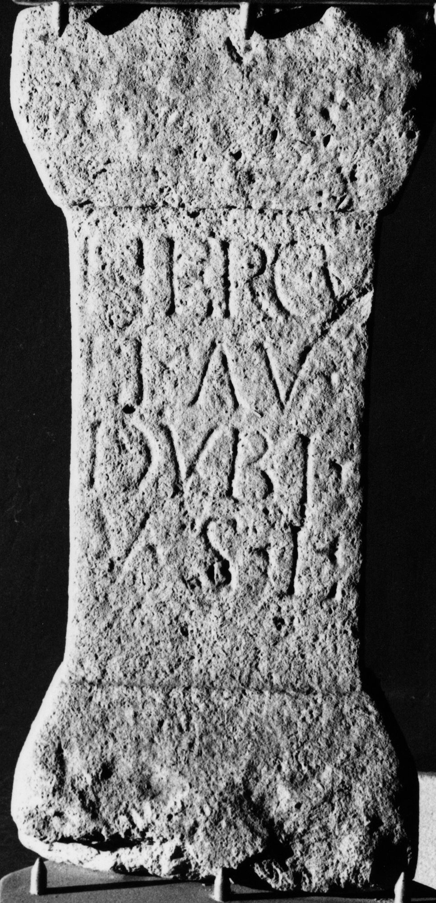

# EDH HD045143. Potaissa

**Країна.** Румунія

**Провінція (код EDH).** Dac

**Місце знахідки (антична назва).** Potaissa

**Сучасна назва.** Turda

**Координати.** 46.564676,23.797106299

**Зберігання.** Turda, Muz. Ist.

**Датування (роки, від'ємні до н. е.).** 171 … 250

**Тип пам'ятки.** Altar

## Текст (латинь, скорочення розкрито)

```
Hercu/li Au(relius) / Dubi(tatus?) / v(otum) s(olvit) l(ibens)
```

## Текст у вихідному записі

```
HERCV / LI AV / DVBI / V S L
```

## Коментар

Z. 3: möglicherweise auch Dubi(us). (B): Bǎrbulescu: Z. 2: Au[r(elius)].

## Література

M. Bǎrbulescu, ActaMusNapoca 14, 1977, 178, Nr. 39. (B) #

## Фото



Джерело https://edh.ub.uni-heidelberg.de/edh/inschrift/HD045143, ліцензія CC BY-SA 4.0. Оригінальний XML в архіві сирі_дані/edh_xml.zip
