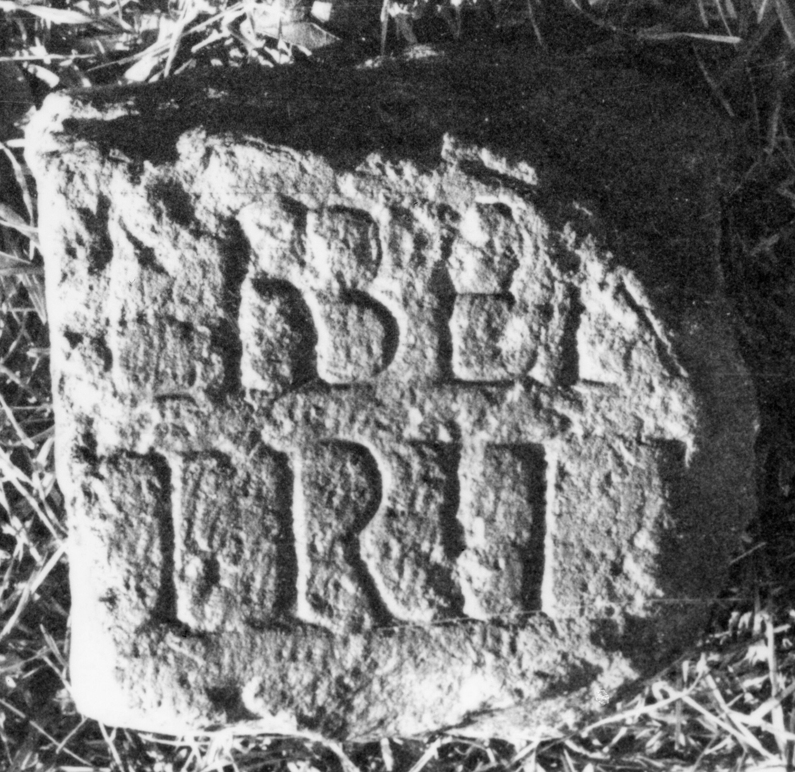

# EDH HD045191. Micia

**Країна.** Румунія

**Провінція (код EDH).** Dac

**Місце знахідки (антична назва).** Micia

**Сучасна назва.** Veţel

**Координати.** 45.914556455,22.816543578

**Зберігання.** Deva, Muz. Civil. Dac. şi Rom.

**Датування (роки, від'ємні до н. е.).** 131 … 270

**Тип пам'ятки.** Altar?

**Розміри (висота, ширина, глибина, см).** -16.0 × -13.0 × -11.0

## Текст (латинь, скорочення розкрито)

```
Liber[o Pa?]/tri Li[berae](?) / [&
```

## Текст у вихідному записі

```
LIBER[ ] / TRI LI[ ] / [
```

## Література

IDR 3, 3, 106; fig. 82.
- CIL 03, 12566. #

## Фото



Джерело https://edh.ub.uni-heidelberg.de/edh/inschrift/HD045191, ліцензія CC BY-SA 4.0. Оригінальний XML в архіві сирі_дані/edh_xml.zip
