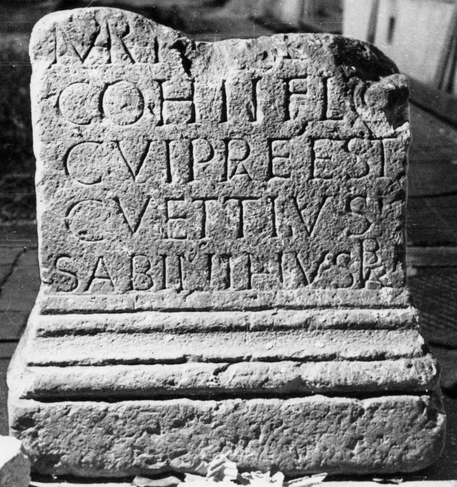

# EDH HD045193. Micia, aus?

**Країна.** Румунія

**Провінція (код EDH).** Dac

**Місце знахідки (антична назва).** Micia, aus?

**Сучасна назва.** Avrig

**Деталі знахідки.** {Schloß Brukenthal, Park}

**Координати.** 45.730456731,24.375958441

**Зберігання.** Sibiu, Muz. Brukenthal

**Датування (роки, від'ємні до н. е.).** 151 … 170

**Матеріал.** Tuff

**Тип пам'ятки.** Altar?

**Розміри (висота, ширина, глибина, см).** -67.0 × 60.0 × 50.0

## Текст (латинь, скорочення розкрито)

```
Mart[i Gra]d[ivo] / coh(ors) II Fl(avia) Co(mmagenorum) / cui praeest / C(aius) Vettius / Sabinianus praef(ectus)
```

## Текст у вихідному записі

```
MART[ ]D[ ] / COH II FL CO / CVI PRAEEST / C VETTIVS / SABINIANVS PRAEF
```

## Коментар

Altar oder Statuenbasis.

## Література

IDR 3, 3, 108; fig. 84 (Foto u. Zeichnung).
- CIL 03, 01619.
- CIL 03, 07854. #

## Фото



Джерело https://edh.ub.uni-heidelberg.de/edh/inschrift/HD045193, ліцензія CC BY-SA 4.0. Оригінальний XML в архіві сирі_дані/edh_xml.zip
