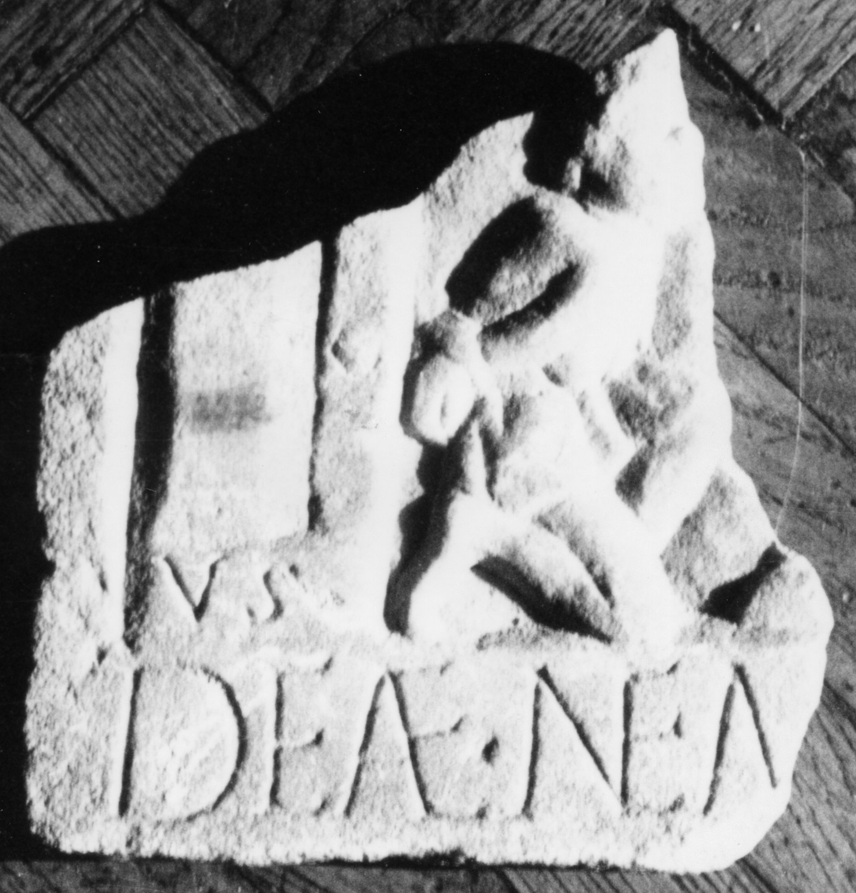

# EDH HD045228. Micia

**Країна.** Румунія

**Провінція (код EDH).** Dac

**Місце знахідки (антична назва).** Micia

**Сучасна назва.** Veţel

**Деталі знахідки.** {Amphitheater}?

**Координати.** 45.915011781,22.817316055

**Рік знахідки.** 1845

**Зберігання.** Cluj-Napoca, Muz. Naţ. Ist. Transilv.

**Датування (роки, від'ємні до н. е.).** 151 … 250

**Тип пам'ятки.** Relief

**Розміри (висота, ширина, глибина, см).** -13.5 × -12.5 × 2.0

## Текст (латинь, скорочення розкрито)

```
V(otum?) s(olvit?) // Deae Nem[esi ---?]
```

## Текст у вихідному записі

```
V S / / DEAE NEM[ ]
```

## Коментар

Linke untere Ecke eines Reliefs; Rest eines gefesselt knieenden Barbaren erhalten; Z. 1 im Bild, Z. 2 unterhalb davon.

## Література

IDR 3, 3, 114; fig. 88 (Foto u. Zeichnung).
- CIL 03, 01358.
- AE 2004, 1208.
- D. Alicu, in: Studia historica et archaeologica in honorem magistrae Doina Benea (Timişoara 2004) 16, Nr. 15. - AE 2004. #

## Фото



Джерело https://edh.ub.uni-heidelberg.de/edh/inschrift/HD045228, ліцензія CC BY-SA 4.0. Оригінальний XML в архіві сирі_дані/edh_xml.zip
