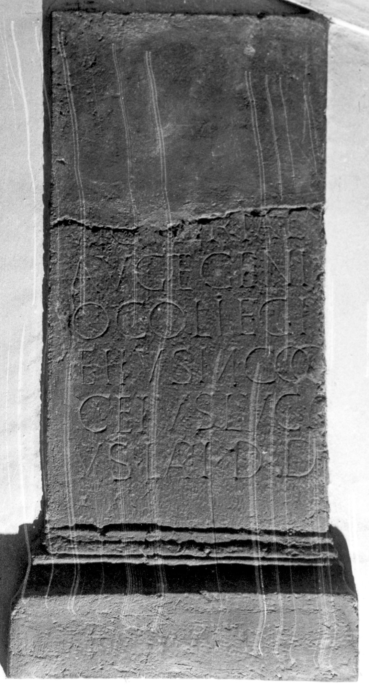

# EDH HD045264. Micia?

**Країна.** Румунія

**Провінція (код EDH).** Dac

**Місце знахідки (антична назва).** Micia?

**Сучасна назва.** Vețel?

**Координати.** 45.913675652,22.815642356

**Зберігання.** Wien, Nationalbibl.

**Датування (роки, від'ємні до н. е.).** 107 … 170

**Матеріал.** Tuff

**Тип пам'ятки.** Altar

## Текст (латинь, скорочення розкрито)

```
Victoriae / Aug(ustae) et Geni/o collegi(i) / eiius(!) M(arcus) Coc/ceius Luci/us lapi(darius) d(onum) d(edit)
```

## Текст у вихідному записі

```
VICTORIAE / AVG ET GENI / O COLLEGI / EIIVS M COC / CEIVS LVCI / VS LAPI D D
```

## Література

IDR 3, 3, 141; fig. 111 (Foto u. Zeichnung).
- CIL 03, 01365.
- A. Buonopane - V. La Monaca, in: G.P. Marchi - J. Pál (Hrsg.), Epigrafi romane di Transilvania. Bibliotheca Capitolare di Verona, Manoscritto CCLXVII (Verona - Szeged 2010) 265, Nr. 12; Zeichnung. #

## Фото



Джерело https://edh.ub.uni-heidelberg.de/edh/inschrift/HD045264, ліцензія CC BY-SA 4.0. Оригінальний XML в архіві сирі_дані/edh_xml.zip
