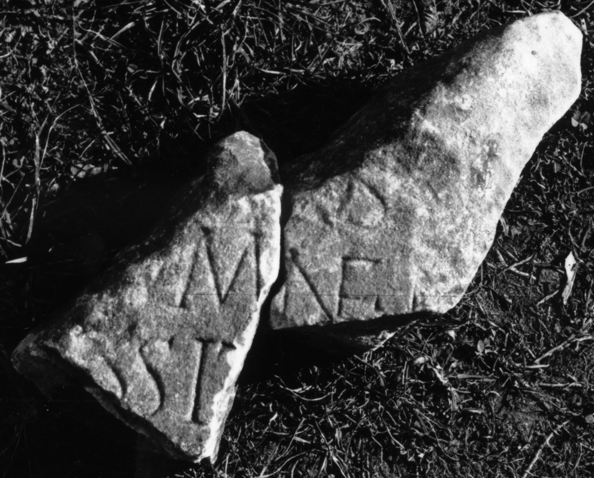
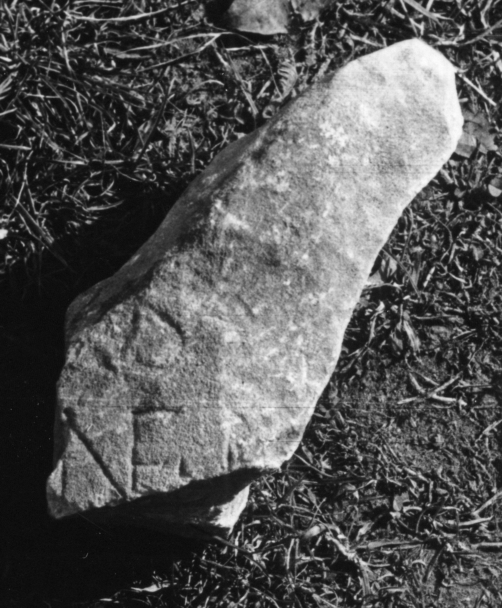

# EDH HD045408. Micia

**Країна.** Румунія

**Провінція (код EDH).** Dac

**Місце знахідки (антична назва).** Micia

**Сучасна назва.** Veţel

**Деталі знахідки.** {Micia}

**Координати.** 45.914556455,22.816629409

**Датування (роки, від'ємні до н. е.).** 131 … 230

**Тип пам'ятки.** Tafel

**Розміри (висота, ширина, глибина, см).** -48.0 × -23.0

## Текст (латинь, скорочення розкрито)

```
$]ius [---] / [--]umne E[-] / [--- i?]ussit V[&
```

## Текст у вихідному записі

```
]IVS [ ] / [ ]VMNE E[ ] / [ ]VSSIT V[
```

## Коментар

In 2 Teile gebrochen; einige Buchstaben, die bei der Auffindung noch lesbar waren, sind inzwischen verloren.

## Література

IDR 3, 3, 145; fig. 114 (Foto u. Zeichnung).
- CIL 03, 07877. #

## Фото





Джерело https://edh.ub.uni-heidelberg.de/edh/inschrift/HD045408, ліцензія CC BY-SA 4.0. Оригінальний XML в архіві сирі_дані/edh_xml.zip
