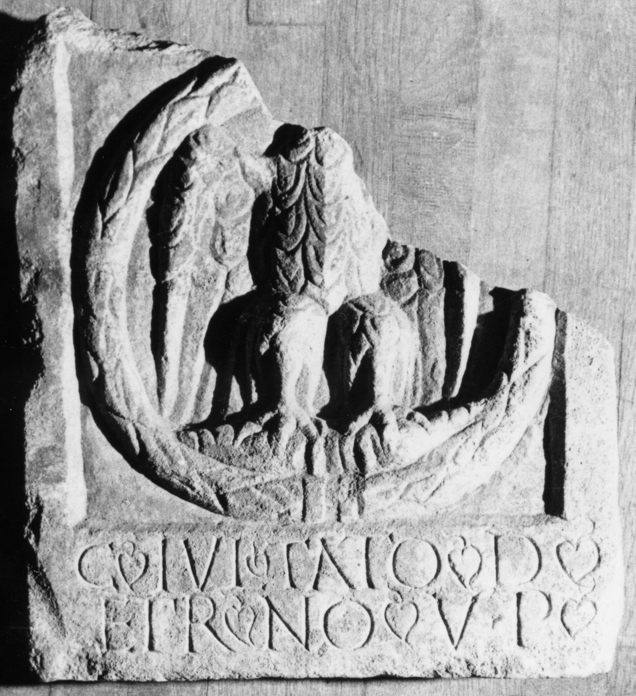

# EDH HD045622. Germisara

**Країна.** Румунія

**Провінція (код EDH).** Dac

**Місце знахідки (антична назва).** Germisara

**Сучасна назва.** Geoagiu

**Деталі знахідки.** {Cigmău}

**Координати.** 45.8967,23.166799999

**Рік знахідки.** 1874

**Зберігання.** Sibiu, Muz. Brukenthal

**Датування (роки, від'ємні до н. е.).** 151 … 230

**Тип пам'ятки.** Relief

**Розміри (висота, ширина, глибина, см).** 33.0 × 29.0 × 5.5

## Текст (латинь, скорочення розкрито)

```
C(aius) Iul(ius) Tato d(eo) / (a)et(e)rno v(otum) p(osuit)
```

## Текст у вихідному записі

```
C IVL TATO D / ETRNO V P
```

## Коментар

Darstellung eines Adlers innerhalb eines Kranzes; Inschrift auf dem unteren Rahmen. Hederae.

## Література

IDR 3, 3, 216; fig. 166 (Foto u. Zeichnung).
- CIL 03, 07880. #

## Фото



Джерело https://edh.ub.uni-heidelberg.de/edh/inschrift/HD045622, ліцензія CC BY-SA 4.0. Оригінальний XML в архіві сирі_дані/edh_xml.zip
