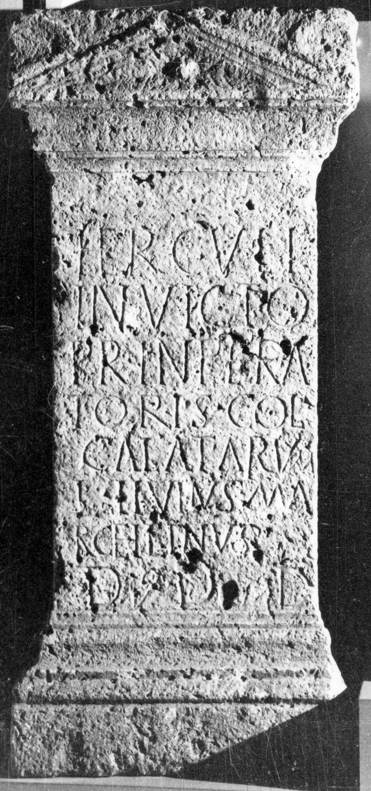

# EDH HD045659. Germisara

**Країна.** Румунія

**Провінція (код EDH).** Dac

**Місце знахідки (антична назва).** Germisara

**Сучасна назва.** Geoagiu

**Деталі знахідки.** {Schloss des Grafen Kuun}, Garten

**Координати.** 45.918281054,23.200389146

**Зберігання.** Deva, Muz. Civil. Dac. şi Rom.

**Датування (роки, від'ємні до н. е.).** 201 … 270

**Тип пам'ятки.** Altar

**Розміри (висота, ширина, глибина, см).** 129.0 × 59.0 × 38.0

## Текст (латинь, скорочення розкрито)

```
Herculi / invicto / pr(o) <sal>(ute) Inpera/toris(!) col(legium) / <G=C>alatarum#<G>alatarum#CALATARUM / L(ucius) Livius Ma/rcellinus / d(onum) d(edit) d(edicavit)
```

## Текст у вихідному записі

```
HERCVLI / INVICTO / PR INPERA / TORIS COL / CALATARVM / L LIVIVS MA / RCELLINVS / D D D
```

## Коментар

Z. 8: hederae.

## Література

IDR 3, 3, 234; fig. 178 (Foto u. Zeichnung).
- CIL 03, 01394.
- ILS 7152. #

## Фото



Джерело https://edh.ub.uni-heidelberg.de/edh/inschrift/HD045659, ліцензія CC BY-SA 4.0. Оригінальний XML в архіві сирі_дані/edh_xml.zip
