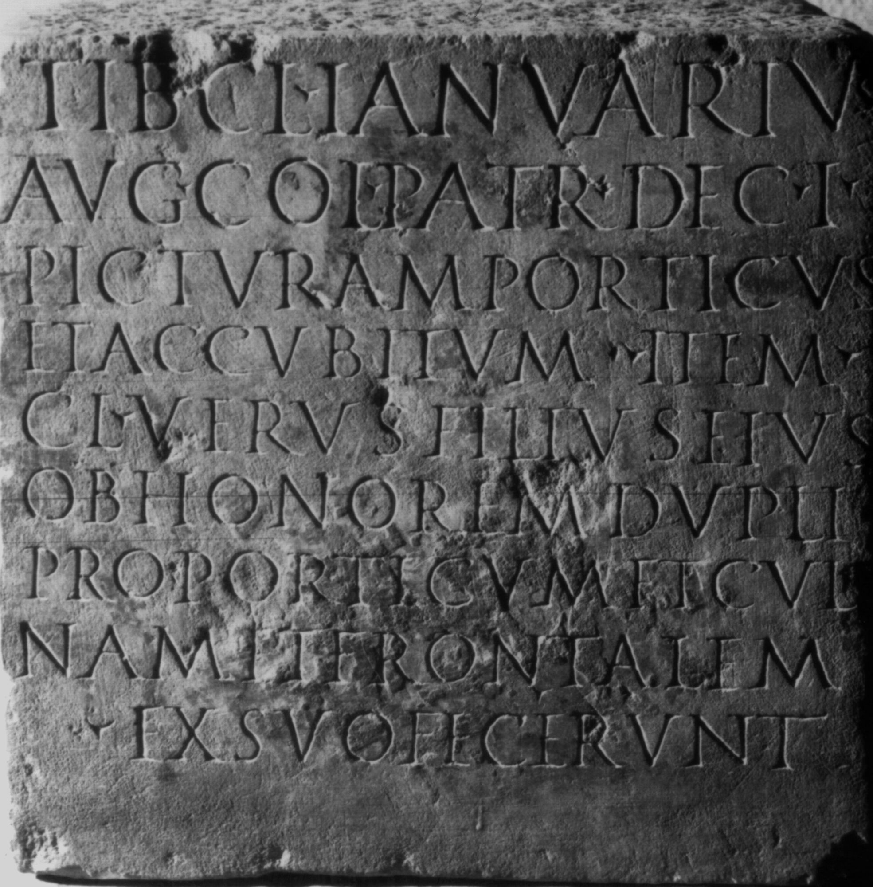

# EDH HD045676. Colonia Ulpia Traiana Sarmizegetusa

**Країна.** Румунія

**Провінція (код EDH).** Dac

**Місце знахідки (антична назва).** Colonia Ulpia Traiana Sarmizegetusa

**Сучасна назва.** Sarmizegetusa

**Деталі знахідки.** {Forum Vetus}

**Координати.** 45.513391850,22.787731289

**Рік знахідки.** 1877

**Зберігання.** Lugoj, Muz. Ist. Etnogr. Arta

**Датування (роки, від'ємні до н. е.).** 107 … 200

**Тип пам'ятки.** Architekturteil?

**Розміри (висота, ширина, глибина, см).** 30.0 × 31.0 × 29.0

## Текст (латинь, скорочення розкрито)

```
Tib(erius) Cl(audius) Ianuarius / Aug(ustalis) col(oniae) patr(onus) dec(uriae) I / picturam porticus / et accubitum item / Cl(audius) Verus filius eius / ob honorem dupli / proporticum et culi/nam et frontalem / ex suo fecerunt
```

## Текст у вихідному записі

```
TIB CL IANVARIVS / AVG COL PATR DEC I / PICTVRAM PORTICVS / ET ACCVBITVM ITEM / CL VERVS FILIVS EIVS / OB HONOREM DVPLI / PROPORTICVM ET CVLI / NAM ET FRONTALEM / EX SVO FECERVNT
```

## Коментар

Möglicherweise Block aus einem architektonischen Zusammenhang.

## Література

CIL 03, 07960.
- IDR 3, 2, 013; fig. 10.
- I. Piso, in: I. Piso (Hrsg.), Le forum vetus de Sarmizegetusa 1 (Bucureşti 2006) 255-257, Nr. 36; Fig. 3, 34. #

## Фото



Джерело https://edh.ub.uni-heidelberg.de/edh/inschrift/HD045676, ліцензія CC BY-SA 4.0. Оригінальний XML в архіві сирі_дані/edh_xml.zip
