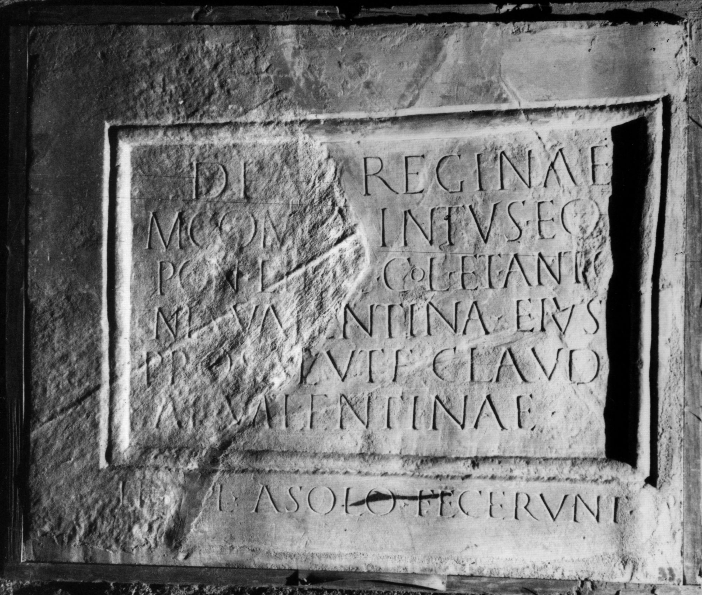

# EDH HD045703. Colonia Ulpia Traiana Sarmizegetusa

**Країна.** Румунія

**Провінція (код EDH).** Dac

**Місце знахідки (антична назва).** Colonia Ulpia Traiana Sarmizegetusa

**Сучасна назва.** Sarmizegetusa

**Координати.** 45.516666699,22.783333299

**Зберігання.** Deva, Muz. Civil. Dac. şi Rom.

**Датування (роки, від'ємні до н. е.).** 171 … 200

**Тип пам'ятки.** Tafel

**Розміри (висота, ширина, глибина, см).** 74.0 × 90.0 × 5.0

## Текст (латинь, скорочення розкрито)

```
Deae [Re]ginae / M(arcus) Com(inius) Q[u]intus eq(uo) p(ublico) / pon(tifex) et q(uin)q(uennalis) col(oniae) et Anto/nia Valentina eius / pro salute Claudi/ae Valentinae // templ(um) a solo fecerunt
```

## Текст у вихідному записі

```
DEAE [ ]GINAE / M COM Q[ ]INTVS EQ P / PON ET QQ COL ET ANTO / NIA VALENTINA EIVS / PRO SALVTE CLAVDI / AE VALENTINAE / / TEMPL A SOLO FECERVNT
```

## Коментар

(B): SIRIS: abweichende Angabe des Wechsel des Inschriftfeldes (Z. 4/5 statt 6/7); Ardevan: Z. 2: Comin(ius); Z. 4/5 u. 5/6: keine Angabe der Zeilenfälle.

## Література

CIL 03, 07907.
- IDR 3, 2, 019; fig. 15.
- SIRIS 681. (B)
- AE 1993, 1344.
- L. Bricault, Recueil des inscriptions concernant les cultes Isiaques (RICIS) (Paris 2005) 726, Nr. 616/0201.
- R. Ardevan, in: L. Mrozewicz - K. Ilski (Hrsg.), Prosopographica (Poznań 1993) 228, Nr. 2. (B) - AE 1993. #

## Фото



Джерело https://edh.ub.uni-heidelberg.de/edh/inschrift/HD045703, ліцензія CC BY-SA 4.0. Оригінальний XML в архіві сирі_дані/edh_xml.zip
