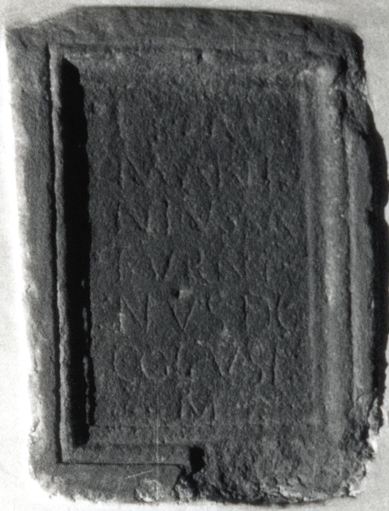

# EDH HD045746. Ampelum

**Країна.** Румунія

**Провінція (код EDH).** Dac

**Місце знахідки (антична назва).** Ampelum

**Сучасна назва.** Zlatna

**Координати.** 46.1112157,23.220529100

**Зберігання.** Wien, Nationalbibl.

**Датування (роки, від'ємні до н. е.).** 171 … 270

**Тип пам'ятки.** Altar

## Текст (латинь, скорочення розкрито)

```
I(ovi) O(ptimo) M(aximo) / M(arcus) Anto/nius Sa/turni/nus dec(urio) / col(oniae) v(otum) s(olvit) l(ibens) / m(erito) // I(ovi) O(ptimo) M(aximo) / M(arcus) Anto/nius Sa/turnin/us / v(otum) s(olvit) l(ibens) m(erito)
```

## Текст у вихідному записі

```
I O M / M ANTO / NIVS SA / TVRNI / NVS DEC / COL V S L / M / / I O M / M ANTO / NIVS SA / TVRNIN / VS / V S L M
```

## Коментар

Die beiden Inschriften befinden sich auf 2 Seiten des Altars.

## Література

IDR 3, 3, 308; fig. 230a (Zeichnung).
- IDR 3, 3, 309; fig. 230b (Zeichnung).
- CIL 03, 01282.
- CIL 03, 01283.
- A. Buonopane - V. La Monaca, in: G.P. Marchi - J. Pál (Hrsg.), Epigrafi romane di Transilvania. Bibliotheca Capitolare di Verona, Manoscritto CCLXVII (Verona - Szeged 2010) 289, Nr. 36; Foto u. Zeichnung. #

## Фото



Джерело https://edh.ub.uni-heidelberg.de/edh/inschrift/HD045746, ліцензія CC BY-SA 4.0. Оригінальний XML в архіві сирі_дані/edh_xml.zip
