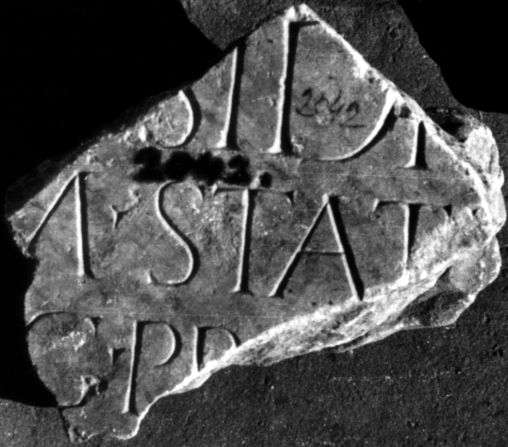

# EDH HD045766. Colonia Ulpia Traiana Sarmizegetusa?

**Країна.** Румунія

**Провінція (код EDH).** Dac

**Місце знахідки (антична назва).** Colonia Ulpia Traiana Sarmizegetusa?

**Сучасна назва.** Sarmizegetusa?

**Координати.** 45.516666699,22.783333299

**Зберігання.** Deva, Muz. Civil. Dac. şi Rom.

**Датування (роки, від'ємні до н. е.).** 131 … 158

**Матеріал.** Marmor

**Тип пам'ятки.** Tafel

**Розміри (висота, ширина, глибина, см).** -21.0 × -21.0 × 5.0

## Текст (латинь, скорочення розкрито)

```
[Deae I]sidi [et Serapidi] / [---] M(arcus) Stati[us Priscus] / [--- leg(atus) Au]g(usti) pr(o) [pr(aetore) ---] / [&
```

## Текст у вихідному записі

```
[ ]SIDI [ ] / [ ] M STATI[ ] / [ ]G PR [ ] / [
```

## Коментар

M. Statius Priscus war 159 n. Chr. cos. ord. (B): SIRIS: abweichende Textwiedergabe / Ergänzungen.

## Література

IDR 3, 2, 229; fig. 184 (Foto und Zeichnung).
- SIRIS 687. (B)
- L. Bricault, Recueil des inscriptions concernant les cultes Isiaques (RICIS) (Paris 2005) 729, Nr. 616/0302.
- PIR (2. Aufl.) S 880. #

## Фото



Джерело https://edh.ub.uni-heidelberg.de/edh/inschrift/HD045766, ліцензія CC BY-SA 4.0. Оригінальний XML в архіві сирі_дані/edh_xml.zip
