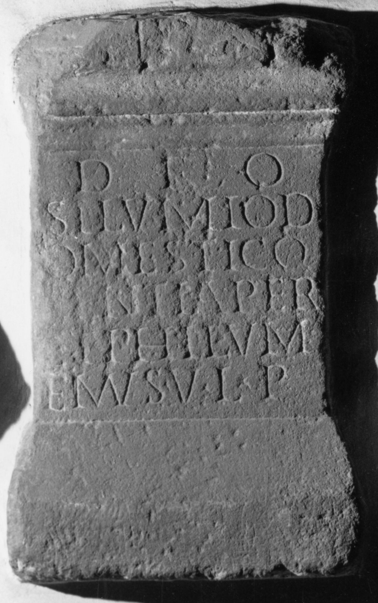

# EDH HD045771. Ampelum

**Країна.** Румунія

**Провінція (код EDH).** Dac

**Місце знахідки (антична назва).** Ampelum

**Сучасна назва.** Zlatna

**Координати.** 46.1112157,23.220529100

**Зберігання.** Wien, Nationalbibl.

**Датування (роки, від'ємні до н. е.).** 151 … 250

**Тип пам'ятки.** Altar

## Текст (латинь, скорочення розкрито)

```
Deo / Silv<an=MI>o#Silv<an>o#SILVMIO / D/omestico / Senti Aper / et Philum/enus v(otum) l(ibentes) p(osuerunt)
```

## Текст у вихідному записі

```
DEO / SILVMIO / D / OMESTICO / SENTI APER / ET PHILVM / ENVS V L P
```

## Література

IDR 3, 3, 328; fig. 243 (Foto u. Zeichnung).
- CIL 03, 01306.
- A. Buonopane - V. La Monaca, in: G.P. Marchi - J. Pál (Hrsg.), Epigrafi romane di Transilvania. Bibliotheca Capitolare di Verona, Manoscritto CCLXVII (Verona - Szeged 2010) 288, Nr. 35; Foto u. Zeichnung. #

## Фото



Джерело https://edh.ub.uni-heidelberg.de/edh/inschrift/HD045771, ліцензія CC BY-SA 4.0. Оригінальний XML в архіві сирі_дані/edh_xml.zip
