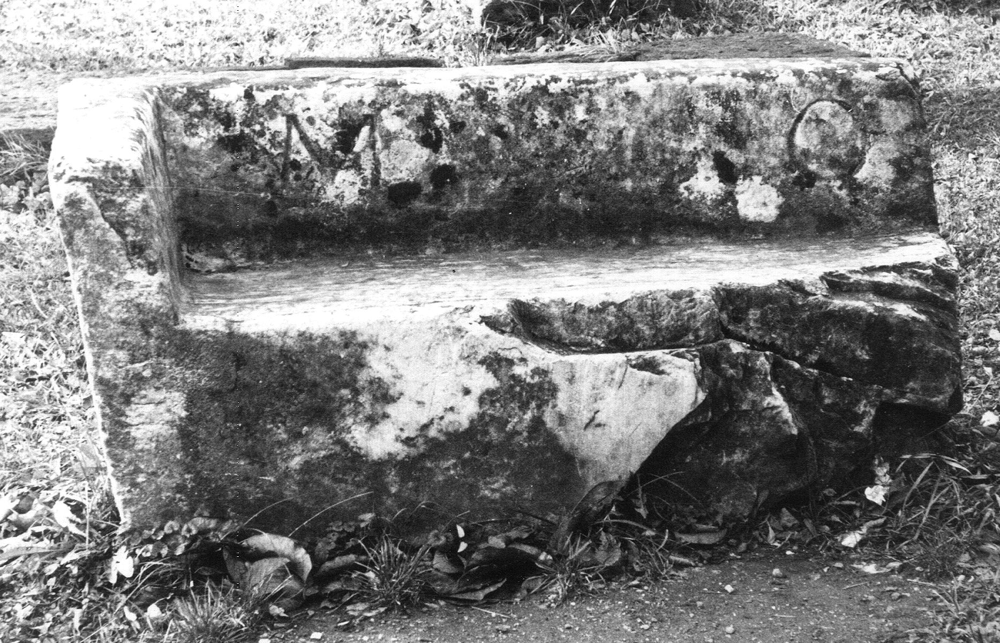

# EDH HD045972. Colonia Ulpia Traiana Sarmizegetusa, aus

**Країна.** Румунія

**Провінція (код EDH).** Dac

**Місце знахідки (антична назва).** Colonia Ulpia Traiana Sarmizegetusa, aus

**Сучасна назва.** Zam

**Деталі знахідки.** {ehemaliges Schloss Nopcsa}

**Координати.** 46.007752922,22.442268133

**Рік знахідки.** -1840

**Зберігання.** Deva, Muz. Civil. Dac. şi Rom.

**Датування (роки, від'ємні до н. е.).** 107 … 250

**Тип пам'ятки.** Architekturteil

**Розміри (висота, ширина, глибина, см).** 70.0 × -140.0 × 51.0

## Текст (латинь, скорочення розкрито)

```
$] M(arcus?) O[---]
```

## Текст у вихідному записі

```
] M O[ ]
```

## Коментар

Sitzbank des Amphitheaters in Sarmizegetusa.

## Література

IDR 3, 2, 041; fig. 29.
- CIL 03, 01523. #

## Фото



Джерело https://edh.ub.uni-heidelberg.de/edh/inschrift/HD045972, ліцензія CC BY-SA 4.0. Оригінальний XML в архіві сирі_дані/edh_xml.zip
