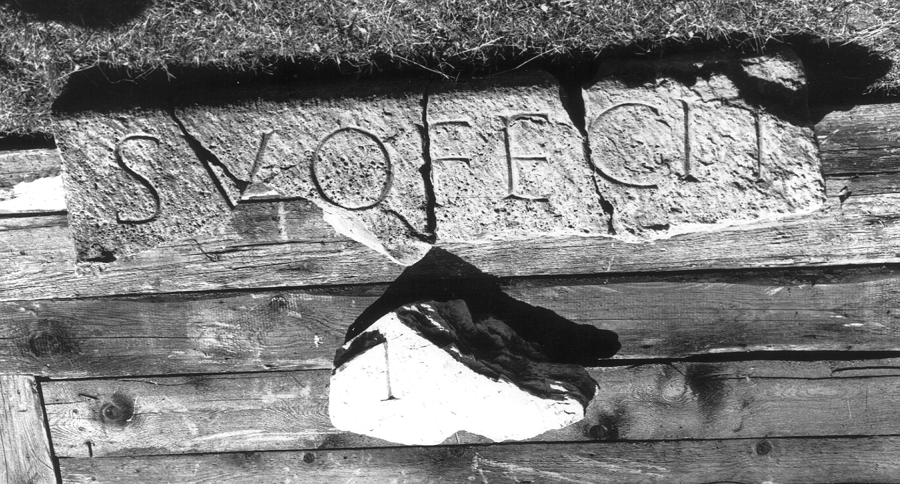

# EDH HD045980. Colonia Ulpia Traiana Sarmizegetusa

**Країна.** Румунія

**Провінція (код EDH).** Dac

**Місце знахідки (антична назва).** Colonia Ulpia Traiana Sarmizegetusa

**Сучасна назва.** Sarmizegetusa

**Деталі знахідки.** {Amphitheater}

**Координати.** 45.516685035,22.785926378

**Зберігання.** Sarmizegetusa, Muz. Arh.

**Датування (роки, від'ємні до н. е.).** 107 … 250

**Тип пам'ятки.** Architekturteil

**Розміри (висота, ширина, глибина, см).** 30.0 × 135.0 × 20.0

## Текст (латинь, скорочення розкрито)

```
[--- de] suo fecit [---] // [---]V[---]
```

## Текст у вихідному записі

```
[ ] SVO FECIT [ ] / / [ ]V[ ]
```

## Коментар

Mehrere teilweise aneinanderpassende Fragement erhalten. Abmessungen der größeren Gruppe aneinanderpassender Fragmente s.o.; Abmessungen der kleineren Gruppe: 32 x 42 x 20.

## Література

IDR 3, 2, 050; fig. 37 a u. b (Fotos u. Zeichnungen). #

## Фото



Джерело https://edh.ub.uni-heidelberg.de/edh/inschrift/HD045980, ліцензія CC BY-SA 4.0. Оригінальний XML в архіві сирі_дані/edh_xml.zip
