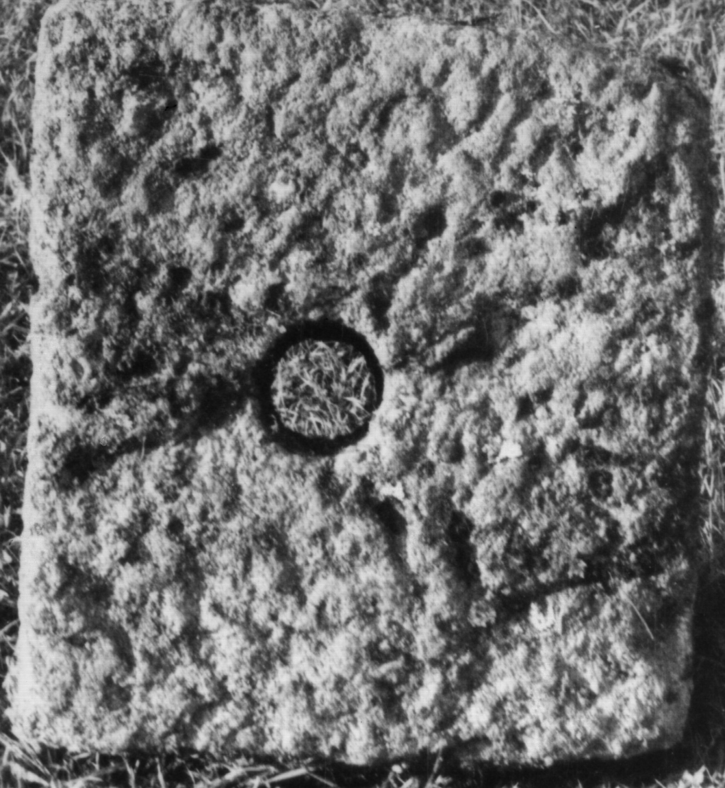
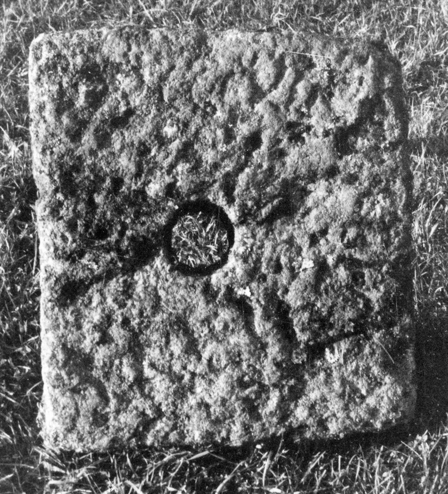

# EDH HD045988. Colonia Ulpia Traiana Sarmizegetusa

**Країна.** Румунія

**Провінція (код EDH).** Dac

**Місце знахідки (антична назва).** Colonia Ulpia Traiana Sarmizegetusa

**Сучасна назва.** Sarmizegetusa

**Деталі знахідки.** {Amphitheater}

**Координати.** 45.516685035,22.785926378

**Зберігання.** Sarmizegetusa, Muz. Arh.

**Датування (роки, від'ємні до н. е.).** 107 … 250

**Матеріал.** Gesteine

**Тип пам'ятки.** Architekturteil

**Розміри (висота, ширина, глибина, см).** 60.0 × 50.0 × 21.0

## Текст (латинь, скорочення розкрито)

```
P(edes) CCCXC
```

## Текст у вихідному записі

```
P CCCXC
```

## Коментар

Block zur Fixierung eines der Pfähle für das velarium.

## Література

IDR 3, 2, 058; fig. 41, 58 (Zeichnung). #

## Фото





Джерело https://edh.ub.uni-heidelberg.de/edh/inschrift/HD045988, ліцензія CC BY-SA 4.0. Оригінальний XML в архіві сирі_дані/edh_xml.zip
