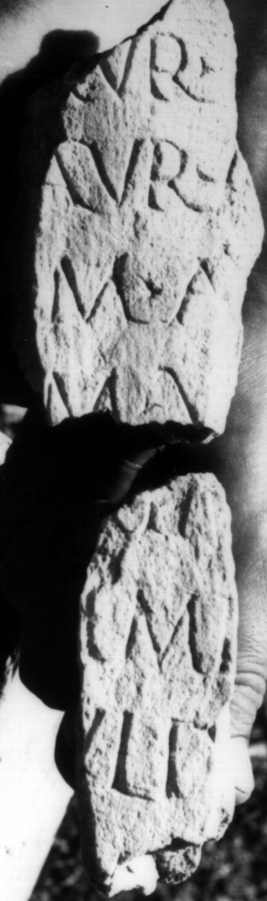
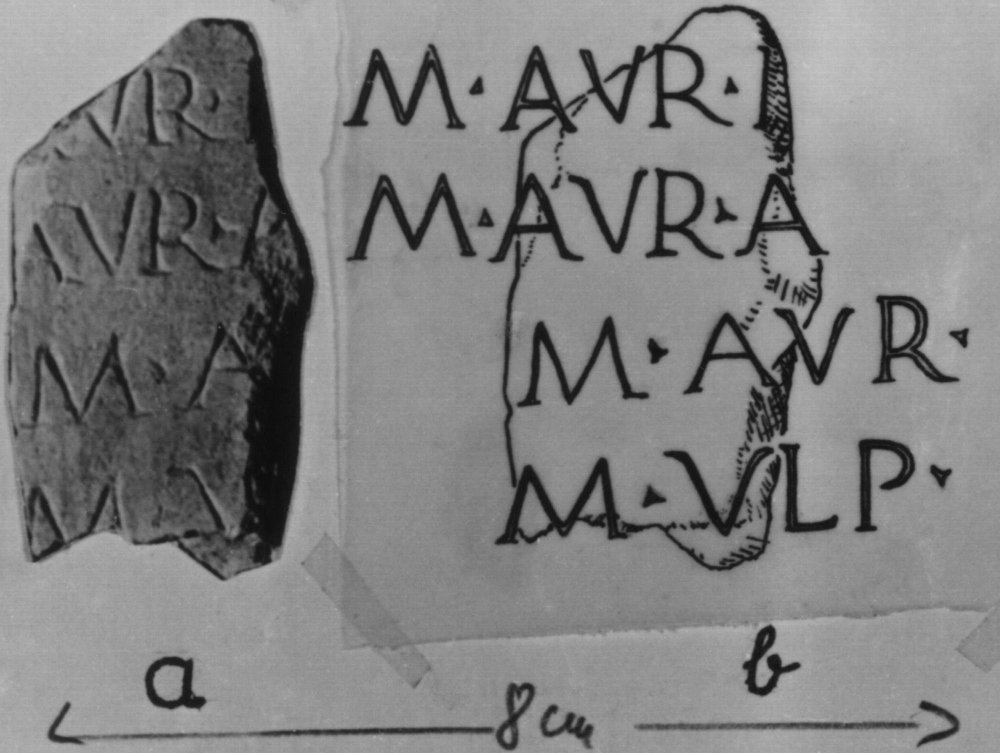
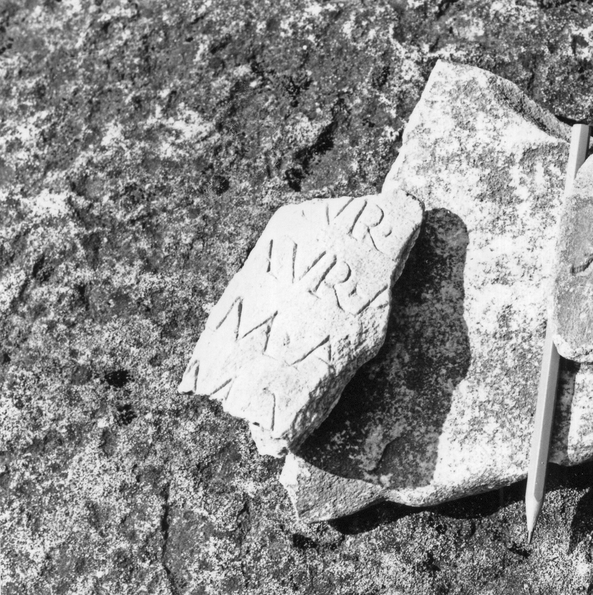

# EDH HD045998. Colonia Ulpia Traiana Sarmizegetusa

**Країна.** Румунія

**Провінція (код EDH).** Dac

**Місце знахідки (антична назва).** Colonia Ulpia Traiana Sarmizegetusa

**Сучасна назва.** Sarmizegetusa

**Деталі знахідки.** {Forum Vetus}

**Координати.** 45.513391850,22.787731289

**Зберігання.** Sarmizegetusa, Muz. Arh.

**Датування (роки, від'ємні до н. е.).** 151 … 250

**Тип пам'ятки.** Tafel

**Розміри (висота, ширина, глибина, см).** -11.0 × -4.0 × 2.0

## Текст (латинь, скорочення розкрито)

```
[M(arcus)] Aur(elius) I(?)[---] / [M(arcus)] Aur(elius) A[---] / [---] M(arcus) Au[r(elius) ---] / [---] M(arcus) U[lp(ius) ---] // [---]anu[s] / [---]AMI[---] / [--- I]uliu[s &
```

## Текст у вихідному записі

```
[ ] AVR I[ ] / [ ] AVR A[ ] / [ ] M AV[ ] / [ ] M V[ ] / / [ ]ANV[ ] / [ ]AMI[ ] / [ ]VLIV[
```

## Коментар

Zwei nicht aneinander passende Fragmente erhalten. IDR gibt lediglich die Maße eines der beiden Fragmente an. (B): geringfügige, von Fotos/Zeichnungen abweichende Textwiedergabe.

## Література

IDR 3, 2, 066; fig. 54 (Fotos u. Zeichungen). (B) #

## Фото







Джерело https://edh.ub.uni-heidelberg.de/edh/inschrift/HD045998, ліцензія CC BY-SA 4.0. Оригінальний XML в архіві сирі_дані/edh_xml.zip
