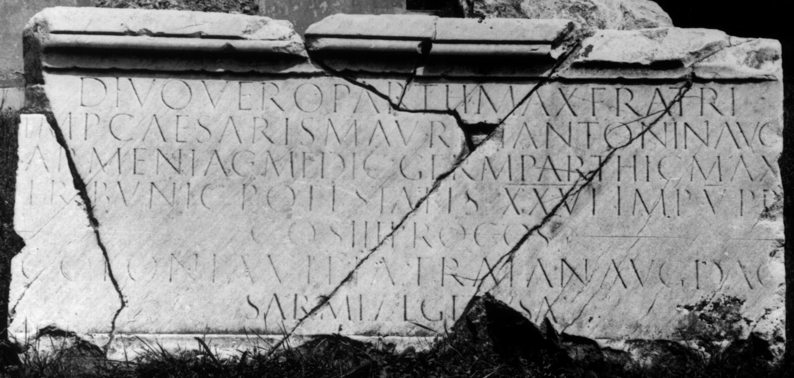

# EDH HD046005. Colonia Ulpia Traiana Sarmizegetusa, aus

**Країна.** Румунія

**Провінція (код EDH).** Dac

**Місце знахідки (антична назва).** Colonia Ulpia Traiana Sarmizegetusa, aus

**Сучасна назва.** Râu de Mori

**Деталі знахідки.** {Curia der Kendeffy}, sekundär verwendet

**Координати.** 45.496146327,22.855258584

**Рік знахідки.** -1700

**Зберігання.** Deva, Muz. Civil. Dac. şi Rom.

**Датування (роки, від'ємні до н. е.).** 172 … 

**Тип пам'ятки.** Tafel

**Розміри (висота, ширина, глибина, см).** -121.0 × -244.0 × 25.0

## Текст (латинь, скорочення розкрито)

```
Divo Vero Parth(ico) max(imo) fratri / Imp(eratoris) Caesaris M(arci) Aureli Antonin(i) Aug(usti) / Armeniac(i) Medic(i) Germ(anici) Parthic(i) max(imi) / tribunic(iae) potestatis XXVI imp(eratoris) V p(atris) p(atriae) / co(n)s(ulis) III proco(n)s(ulis) / colonia Ulpia Traian(a) Aug(usta) Dac(ica) / Sarmizegetusa
```

## Текст у вихідному записі

```
DIVO VERO PARTH MAX FRATRI / IMP CAESARIS M AVRELI ANTONIN AVG / ARMENIAC MEDIC GERM PARTHIC MAX / TRIBVNIC POTESTATIS XXVI IMP V P P / COS III PROCOS / COLONIA VLPIA TRAIAN AVG DAC / SARMIZEGETVSA
```

## Коментар

Nach Piso stammt die Tafel vom Forum Vetus in Sarmizegetusa.

## Література

CIL 03, 01450.
- ILS 0370.
- IDR 3, 2, 074; fig. 58 (Foto u. Zeichnungen).
- I. Piso, in: I. Piso (Hrsg.), Le forum vetus de Sarmizegetusa 1 (Bucureşti 2006) 224-226, Nr. 8; Fig. 3, 9. #

## Фото



Джерело https://edh.ub.uni-heidelberg.de/edh/inschrift/HD046005, ліцензія CC BY-SA 4.0. Оригінальний XML в архіві сирі_дані/edh_xml.zip
