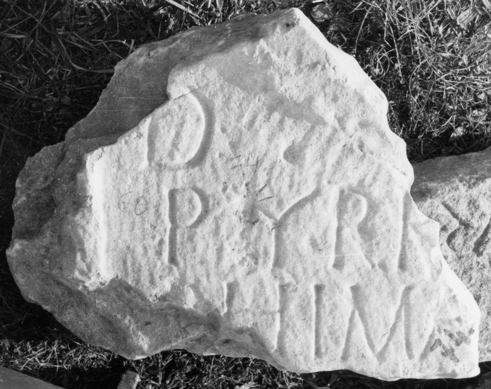

# EDH HD046179. Bucium

**Країна.** Румунія

**Провінція (код EDH).** Dac

**Сучасна назва.** Bucium

**Деталі знахідки.** Corabia, Berg, {"Poduri", Nekropole}

**Координати.** 46.219573986,23.197031020

**Зберігання.** Deva, Muz. Civil. Dac. şi Rom.

**Датування (роки, від'ємні до н. е.).** 171 … 270

**Тип пам'ятки.** Stele

**Розміри (висота, ширина, глибина, см).** -35.0 × -46.0 × 12.0

## Текст (латинь, скорочення розкрито)

```
D(is) [M(anibus)] / Pyrr(h)[ia? Tro]/phima [---] / [&
```

## Текст у вихідному записі

```
D [ ] / PYRR[ ] / PHIMA [ ] / [
```

## Коментар

Oberhalb der Inschrift noch Rest eines Medaillons. IDR III 3: Z. 2:Pyrr[a.

## Література

IDR 3, 3, 433; fig. 317 (Foto u. Zeichnung).
- CIL 03, 07831. #

## Фото



Джерело https://edh.ub.uni-heidelberg.de/edh/inschrift/HD046179, ліцензія CC BY-SA 4.0. Оригінальний XML в архіві сирі_дані/edh_xml.zip
