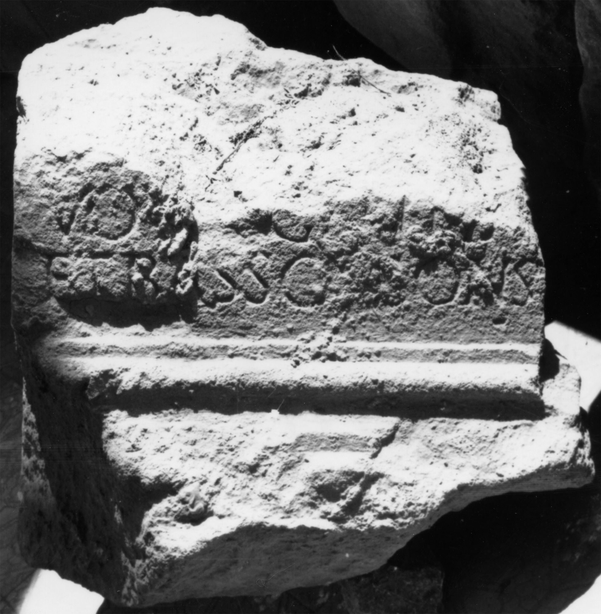

# EDH HD046180. Apulum

**Країна.** Румунія

**Провінція (код EDH).** Dac

**Місце знахідки (антична назва).** Apulum

**Сучасна назва.** Alba Iulia

**Координати.** 46.0669444,23.569999999

**Зберігання.** Alba Iulia, Muz. Unirii

**Датування (роки, від'ємні до н. е.).** 211 … 

**Матеріал.** Kalkstein

**Тип пам'ятки.** Altar?

**Розміри (висота, ширина, глибина, см).** -48.0 × -45.0 × 44.0

## Текст (латинь, скорочення розкрито)

```
$] / CV[--- ex] / vot[o] Gentia[n(o)] / et Basso cons(ulibus)
```

## Текст у вихідному записі

```
] / CV[ ] / VOT[ ] GENTIA[ ] / ET BASSO CONS
```

## Коментар

Altar oder Statuenbasis. Z. 2 (Ende): wohl AN-Ligatur.

## Література

IDR 3, 5, 414; Foto u. Zeichnung.
- PIR (2. Aufl.) H 37.
- PIR (2. Aufl.) P 700. #

## Фото



Джерело https://edh.ub.uni-heidelberg.de/edh/inschrift/HD046180, ліцензія CC BY-SA 4.0. Оригінальний XML в архіві сирі_дані/edh_xml.zip
