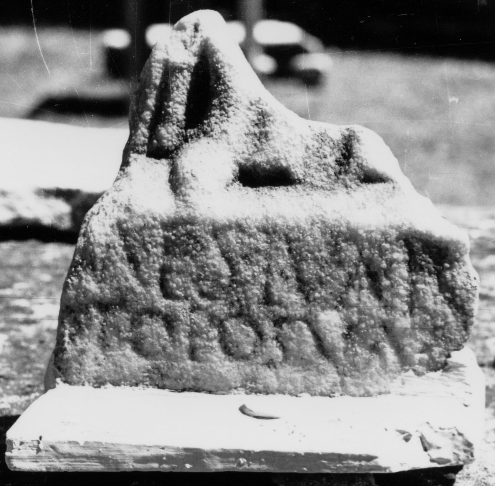

# EDH HD046181. Colonia Ulpia Traiana Sarmizegetusa

**Країна.** Румунія

**Провінція (код EDH).** Dac

**Місце знахідки (антична назва).** Colonia Ulpia Traiana Sarmizegetusa

**Сучасна назва.** Sarmizegetusa

**Координати.** 45.516666699,22.783333299

**Зберігання.** Sarmizegetusa, Muz. Arh.

**Датування (роки, від'ємні до н. е.).** 131 … 270

**Тип пам'ятки.** Relief

**Розміри (висота, ширина, глибина, см).** 10.5 × 11.5 × 3.0

## Текст (латинь, скорочення розкрито)

```
[Deae? Ne]mesi Var[ius? ---] / [---? ex v]oto pos(uit) VA[---]
```

## Текст у вихідному записі

```
[ ]MESI VAR[ ] / [ ]OTO POS VA[ ]
```

## Коментар

Fragment vom unteren Teil eines Reliefs mit einer weiblichen Gestalt; Inschrift auf dem unteren Rahmen.

## Література

IDR 3, 2, 323; fig. 268 (Zeichnung). #

## Фото



Джерело https://edh.ub.uni-heidelberg.de/edh/inschrift/HD046181, ліцензія CC BY-SA 4.0. Оригінальний XML в архіві сирі_дані/edh_xml.zip
