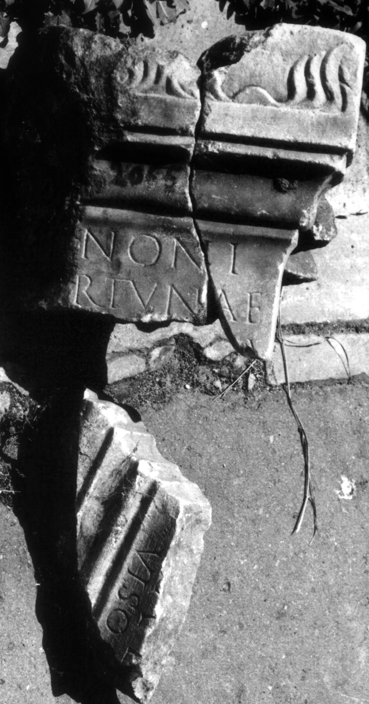

# EDH HD046182. Colonia Ulpia Traiana Sarmizegetusa

**Країна.** Румунія

**Провінція (код EDH).** Dac

**Місце знахідки (антична назва).** Colonia Ulpia Traiana Sarmizegetusa

**Сучасна назва.** Sarmizegetusa

**Координати.** 45.516666699,22.783333299

**Зберігання.** Deva, Muz. Civil. Dac. şi Rom.

**Датування (роки, від'ємні до н. е.).** 151 … 230

**Тип пам'ятки.** Altar

**Розміри (висота, ширина, глибина, см).** -20.0 × -14.0 × 11.0

## Текст (латинь, скорочення розкрито)

```
[Iu]noni / [Fo]rtunae / [& // $] / [---]a(?) e[x] / viso [---]
```

## Текст у вихідному записі

```
[ ]NONI / [ ]RTVNAE / [ / / ] / [ ]A E[ ] / VISO [ ]
```

## Коментар

3 Fragmente erhalten, davon a und b aneinanderpassend; Zugehörigkeit von c unsicher. Maße beziehen sich auf Fragment a; Maße Fragment b und c nicht bekannt. Z. 3: vor A noch ein kleiner Rest vom unteren cornu einer senkrechten oder absteigenden Haste erkennbar. IDR III: Z. 3: [---]a ex.

## Література

IDR 3, 2, 232; fig. 187 (Foto u. Zeichnung).
- CIL 03, 07950. #

## Фото



Джерело https://edh.ub.uni-heidelberg.de/edh/inschrift/HD046182, ліцензія CC BY-SA 4.0. Оригінальний XML в архіві сирі_дані/edh_xml.zip
