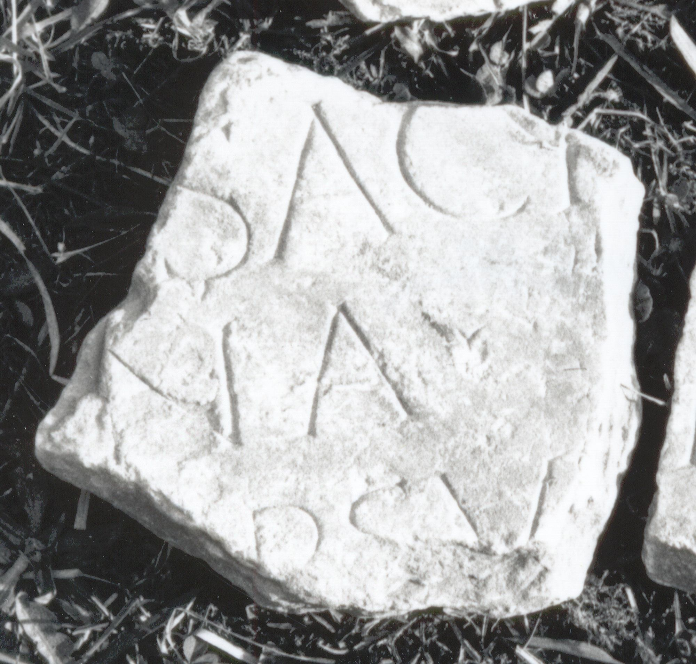
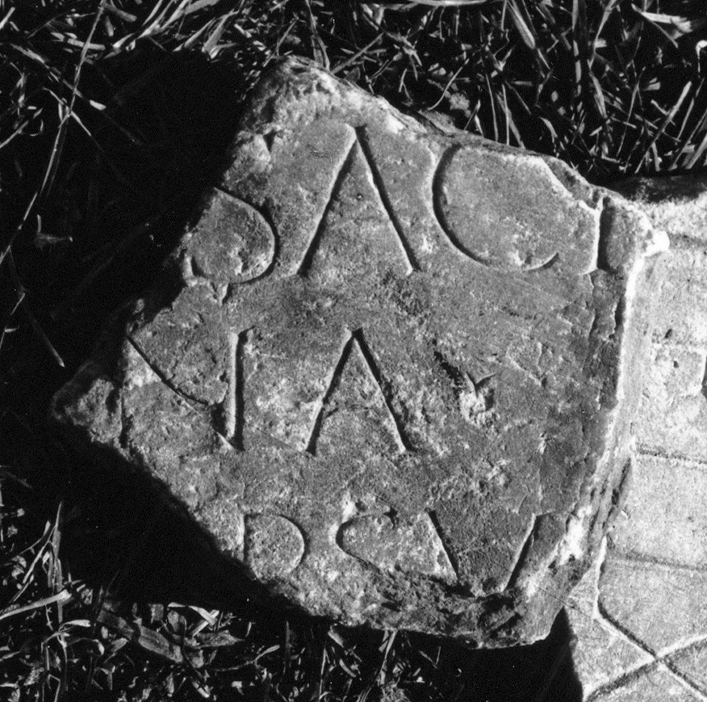

# EDH HD046183. Colonia Ulpia Traiana Sarmizegetusa

**Країна.** Румунія

**Провінція (код EDH).** Dac

**Місце знахідки (антична назва).** Colonia Ulpia Traiana Sarmizegetusa

**Сучасна назва.** Sarmizegetusa

**Координати.** 45.516666699,22.783333299

**Зберігання.** Deva, Muz. Civil. Dac. şi Rom.

**Датування (роки, від'ємні до н. е.).** 107 … 200

**Тип пам'ятки.** Tafel

**Розміри (висота, ширина, глибина, см).** -12.0 × -13.0 × 2.0

## Текст (латинь, скорочення розкрито)

```
$] / [---] sacr(um) [---] / [---]na [---] / [---]R(?)SV[&
```

## Текст у вихідному записі

```
] / [ ] SACR [ ] / [ ]NA [ ] / [ ]RSV[
```

## Література

IDR 3, 2, 359; fig. 296 (Foto u. Zeichnung). #

## Фото





Джерело https://edh.ub.uni-heidelberg.de/edh/inschrift/HD046183, ліцензія CC BY-SA 4.0. Оригінальний XML в архіві сирі_дані/edh_xml.zip
